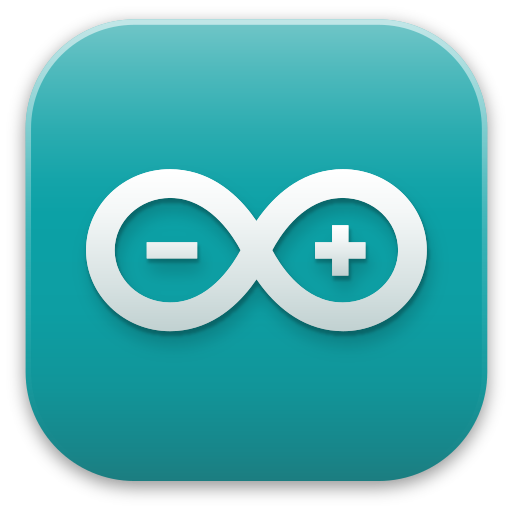
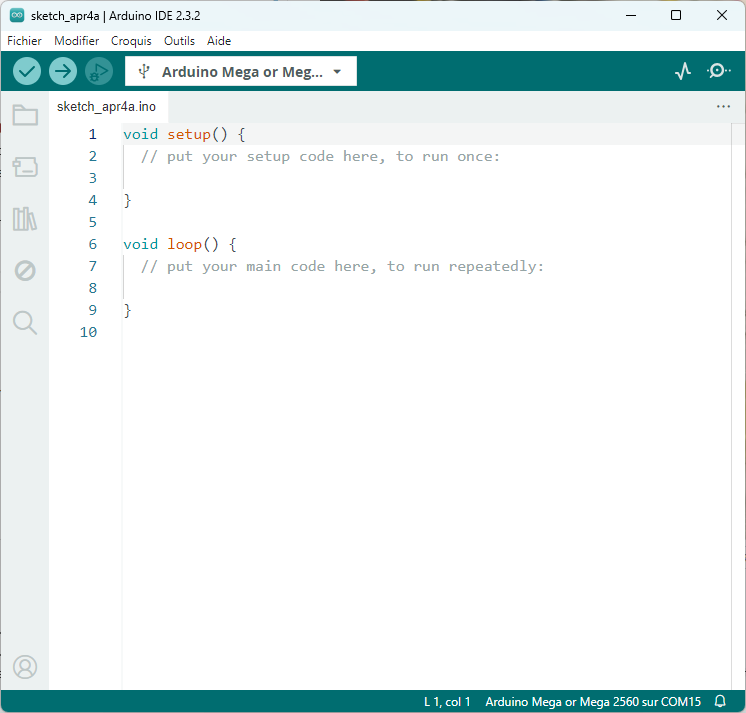
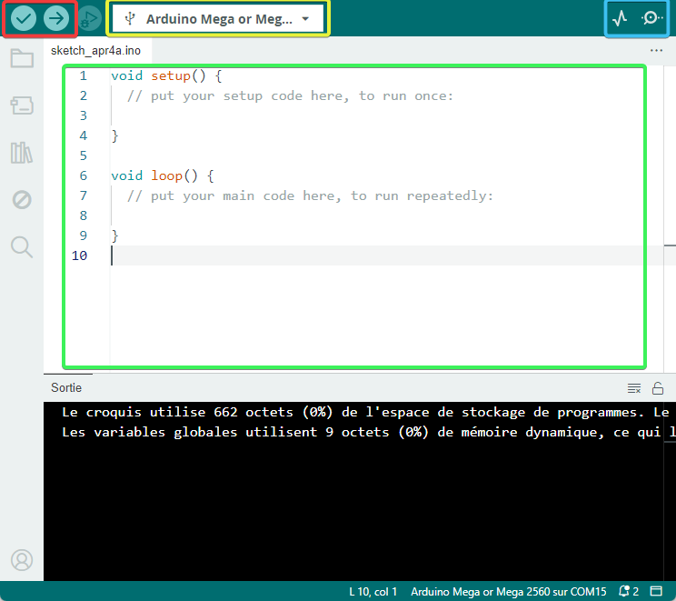
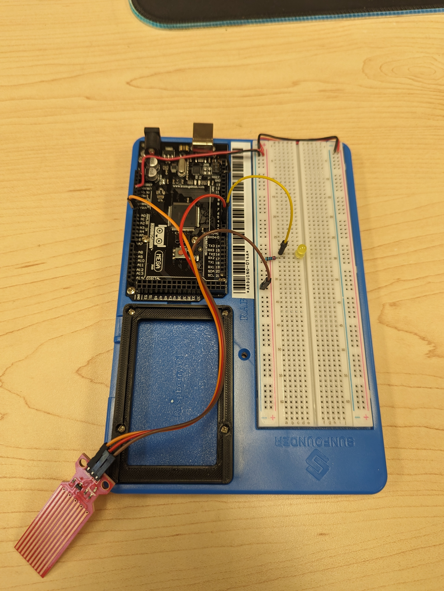
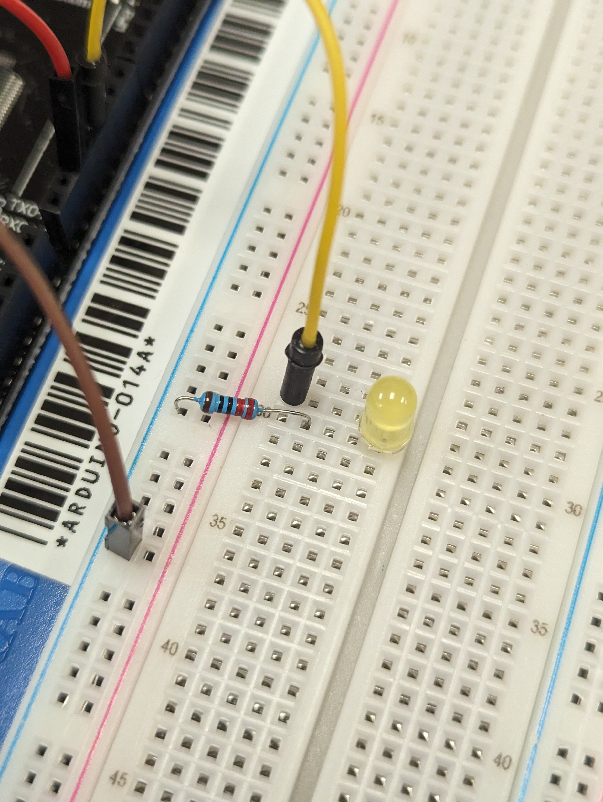
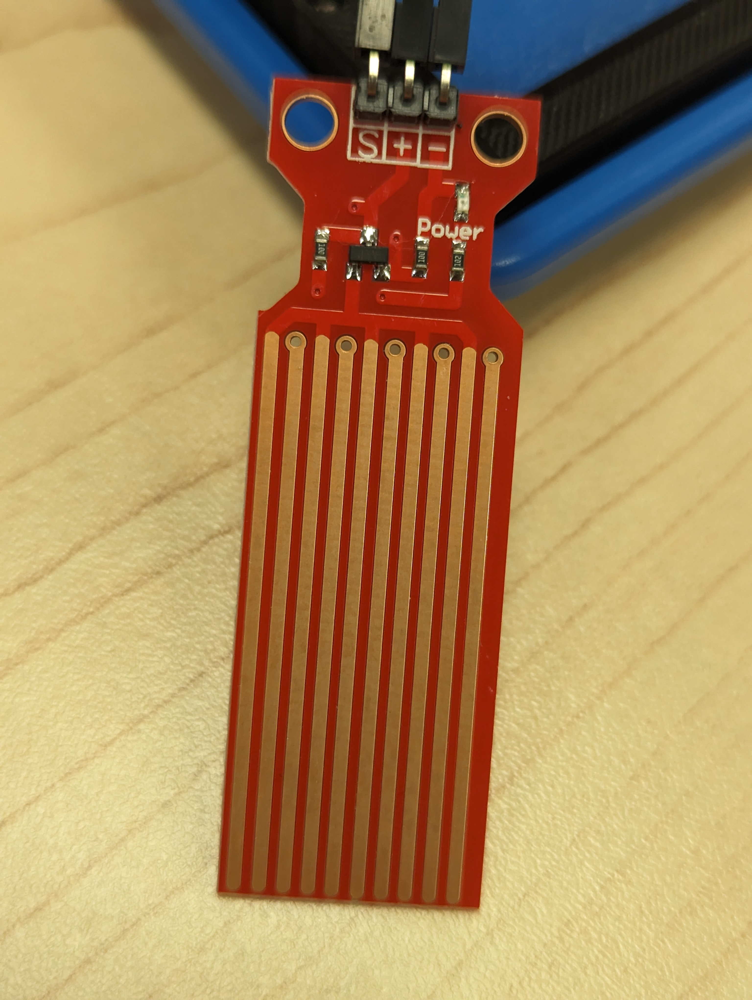
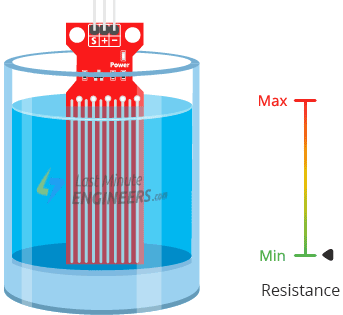
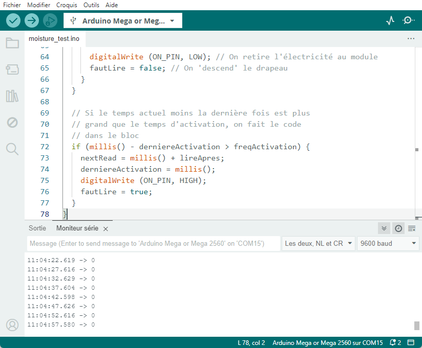

# Atelier express de programmation Arduino <!-- omit in toc -->


<!-- TODO : Peaufiner la fin -->
- [Introduction](#introduction)
- [Étape 1 : Survol de l'environnement de travail](#étape-1--survol-de-lenvironnement-de-travail)
  - [Éléments importants de l'interface](#éléments-importants-de-linterface)
- [Étape 2 : Observation du matériel et du montage](#étape-2--observation-du-matériel-et-du-montage)
- [Étape 3 : Observation du montage](#étape-3--observation-du-montage)
  - [Fonctionnement du capteur d'eau](#fonctionnement-du-capteur-deau)
- [Étape 4 : Brancher l'appareil](#étape-4--brancher-lappareil)
- [Étape 5 : Téléverser le programme](#étape-5--téléverser-le-programme)
- [Étape 6 : Étude du code](#étape-6--étude-du-code)
  - [Partie du haut - Les déclarations des constantes et variables](#partie-du-haut---les-déclarations-des-constantes-et-variables)
  - [Configuration initiale](#configuration-initiale)
  - [Boucle principale](#boucle-principale)
  - [Fonction `tacheHumidite()`](#fonction-tachehumidite)
- [fonction tacheLumiere()](#fonction-tachelumiere)
- [Étape 7 : Téléverser le programme](#étape-7--téléverser-le-programme)
- [Étape 8 : Observer le fonctionnement](#étape-8--observer-le-fonctionnement)
- [Conclusion](#conclusion)

# Introduction
Dans cet atelier express d'environ 30 minutes, vous allez apprendre à programmer une puce sur un circuit imprimé pour réaliser un instrument de mesure d'humidité du sol. Nous allons utiliser une carte qui s'appelle un Arduino. Nous allons également utiliser le logiciel Arduino IDE pour écrire et téléverser le programme sur la puce.

**Cet activité résume assez bien la première année du programme des Techniques de l'informatique du Cégep.** En effet dans le programme, les étudiants apprennent les fondamentaux de la programmation, l'environnement de travail ainsi que le matériel. Ils apprennent également à résoudre des problèmes.

Évidemment, étant une activité de très courte durée et que nous ne pouvons pas nous permettre de perdre du temps, nous allons utiliser un programme déjà écrit. Nous allons nous concentrer sur la compréhension du programme et sur la manière de le téléverser sur la puce.


# Étape 1 : Survol de l'environnement de travail
- Vous remarquez que nous sommes sur des ordinateurs Apple
- L'environnement est un peu différent des ordinateurs Windows ou Chromebook
- Vous avez un logiciel qui s'appelle Arduino IDE
  - Celui devrait être déjà ouvert
  - Si ce n'est pas le cas, recherchez l'icône ci-contre dans la barre des applications et cliquez dessus
  
    

---

L'interface devrait être très similaire à celui-ci



---

## Éléments importants de l'interface



- Dans l'encadré rouge
  - On retrouve un bouton représenter par un crochet. Il s'agit du bouton `Vérifier` qui permet de faire la vérification du code si celui-ci est valide
  - Il y a aussi un bouton avec une flèche vers la droite. Il s'agit du bouton `Téléverser` qui permet de téléverser le code sur la carte électronique
- Dans l'encadré jaune, il s'agit de la liste de sélection de la carte électronique. Dans notre cas, il devrait déjà être sélectionné sur `Arduino Mega...`
- L'encadré bleu à droite sont le traceur série et le moniteur série. C'est ici que nous allons voir les données envoyées par la carte électronique.

# Étape 2 : Observation du matériel et du montage



À votre disposition, vous avez un kit prémonté contenant les éléments suivants:
- Une carte Arduino Mega
- Un capteur d'humidité du sol
- Une DEL avec une résistance
- Un câble USB pour connecter la carte à un ordinateur

> **Question** : Êtes-vous capable d'identifier les différents éléments du kit?

# Étape 3 : Observation du montage
- Observez le montage
- Trouvez la plaque prinpale
  - Celle-ci se nomme l'Arduino Mega
  - Il s'agit du cerveau de l'appareil
- Trouvez la DEL et la résistance
  - La DEL est la petite lumière
  - La résistance est la petite composante électronique avec des bandes de couleurs 
- Trouvez le capteur d'eau
  - Il s'agit d'une plaquette électronique avec des bandes métalliques






## Fonctionnement du capteur d'eau
- Le capteur d'eau est un capteur d'humidité du sol
- Il est composé de plusieurs bandes métalliques
- Chaque bande est alternativement connectée à une anode et une cathode
- Le capteur envoie un signal électrique qui varie en fonction de l'humidité du sol
- Plus le sol est humide, plus le signal est fort, car il y aura moins de résistance
 


- L'Arduino pourra lire ce signal et le convertir en une valeur numérique

# Étape 4 : Brancher l'appareil
- Si ce n'est déjà fait, branchez le câble USB à l'ordinateur
- Dans la liste de sélection de la carte électronique, assurez-vous que `Arduino Mega...` est sélectionné sinon sélectionnez-le

# Étape 5 : Téléverser le programme

- Vous devriez avoir du code de base dans l'Arduino IDE
- Sélectionnez tout le code et effacez-le
- Lancez le navigateur Firefox et allez à l'adresse qui suit :
  
<big><b>👉 [tinyurl.com/soleau24](http://tinyurl.com/soleau24) 👈</b></big>

- Copiez le code dans qui est dans le navigateur
- Collez le code dans l'Arduino IDE



# Étape 6 : Étude du code

Voici le code complet que vous avez collé dans l'Arduino IDE

```ino
// Constante pour les broches
#define MOIST_PIN A0
#define ON_PIN 2
#define LED_PIN 4

// Variables globales
int fautLire = true; // Drapeau pour la lecture
int humVal = 0; // Valeur lue de l'humidité

// Configuration initiale
// Code qui s'exécute une seule fois
// aussi que l'électricité est présente
void setup() {
  // put your setup code here, to run once:
  Serial.begin(9600);
  pinMode(ON_PIN, OUTPUT);
  pinMode(LED_PIN, OUTPUT);
}

// Code qui s'exécute en boucle
// à tant qu'il y a de l'électricité
void loop() {
  tacheHumidite();
  tacheLumiere();
}

// Code pour allumer la lumière
// si l'humidité dépasse une valeur
void tacheLumiere(){
  // Si la valeur de humVal est plus
  // grand que X, écrire la valeur
  // Y sur la broche
  if (humVal > 150) {
    analogWrite(LED_PIN, 255);
  }
  else if (humVal > 100) {
    analogWrite(LED_PIN, 128);
  }
  else if (humVal > 50) {
    analogWrite(LED_PIN, 64);
  } 
  else {
    digitalWrite(LED_PIN, LOW);
  }
}

// Code pour faire la lecture du
// taux d'humidité
// Objectif : On veut lire le niveau d'humidité
// à toutes les 5 secondes
void tacheHumidite(){
  // Déclaration des variables
  // nécessaires à la tâche
  static unsigned long derniereActivation = 0;
  static unsigned long nextRead = 0;
  const unsigned int freqActivation = 5000;
  const int lireApres = 10;

  // Si le drapeau de lecture est à vrai
  // on va effectuer la lecture et
  // descendre le drapeau
  if (fautLire) {
    if (millis() > nextRead)
    {
      humVal = analogRead(MOIST_PIN); // On fait la lecture de la valeur
      Serial.println(humVal); // On envoie la valeur à l'ordinateur

      digitalWrite (ON_PIN, LOW); // On retire l'électricité au module
      fautLire = false; // On 'descend' le drapeau
    }
  }

  // Si le temps actuel moins la dernière fois est plus
  // grand que le temps d'activation, on fait le code
  // dans le bloc
  if (millis() - derniereActivation > freqActivation) {
    nextRead = millis() + lireApres;
    derniereActivation = millis();
    digitalWrite (ON_PIN, HIGH);
    fautLire = true;
  }
}
```

## Partie du haut - Les déclarations des constantes et variables

```ino
// Constante pour les broches
#define MOIST_PIN A0
#define ON_PIN 2
#define LED_PIN 4

// Variables globales
int fautLire = true; // Drapeau pour la lecture
int humVal = 0; // Valeur lue de l'humidité
```

- En mathématiques, une constante est une valeur qui ne change pas
  - En programmation, c'est la même chose
- En mathématiques, les variables sont représentées par des lettres
  - En programmation, on utilise des noms de variables (mot)
- Les variables sont des valeurs qui peuvent changer

---

## Configuration initiale

```ino
// Configuration initiale
// Code qui s'exécute une seule fois
// aussi que l'électricité est présente
void setup() {
  // put your setup code here, to run once:
  Serial.begin(9600);
  pinMode(ON_PIN, OUTPUT);
  pinMode(LED_PIN, OUTPUT);
}
```

- La fonction `setup()` est une fonction spéciale qui s'exécute une seule fois aussitôt que l'électricité est présente
- Lorsque la ligne débute avec `void`, cela signifie que c'est une fonction

## Boucle principale

```ino
// Code qui s'exécute en boucle
// à tant qu'il y a de l'électricité
void loop() {
  tacheHumidite();
  tacheLumiere();
}
```

- La fonction `loop()` est une fonction spéciale qui s'exécute en boucle tant qu'il y a de l'électricité et elle ne s'arrête jamais
- On pourrait laisser l'appareil fonctionner pendant des jours, des mois, des années sans arrêt
- La boucle est répétée des milliers de fois par seconde!
- Dans celle-ci, il y a deux lignes qui appellent deux fonctions `tacheHumidite()` et `tacheLumiere()`
- Ces fonctions sont appelées séquentiellement, c'est-à-dire l'une après l'autre

## Fonction `tacheHumidite()`

```ino
// Code pour faire la lecture du
// taux d'humidité
// Objectif : On veut lire le niveau d'humidité
// à toutes les 5 secondes
void tacheHumidite(){
  // Déclaration des variables
  // nécessaires à la tâche
  static unsigned long derniereActivation = 0;
  static unsigned long nextRead = 0;
  const unsigned int freqActivation = 5000;
  const int lireApres = 10;

  // Si le drapeau de lecture est à vrai
  // on va effectuer la lecture et
  // descendre le drapeau
  if (fautLire) {
    if (millis() > nextRead)
    {
      humVal = analogRead(MOIST_PIN); // On fait la lecture de la valeur
      Serial.println(humVal); // On envoie la valeur à l'ordinateur

      digitalWrite (ON_PIN, LOW); // On retire l'électricité au module
      fautLire = false; // On 'descend' le drapeau
    }
  }

  // Si le temps actuel moins la dernière fois est plus
  // grand que le temps d'activation, on fait le code
  // dans le bloc
  if (millis() - derniereActivation > freqActivation) {
    nextRead = millis() + lireApres;
    derniereActivation = millis();
    digitalWrite (ON_PIN, HIGH);
    fautLire = true;
  }
}
```

- Cette fonction est la plus complexe du programme
- Elle est responsable de la lecture de l'humidité du sol et envoie la valeur lue à l'ordinateur
- Les seules lignes qui sont responsables de la lecture de l'humidité sont les suivantes
  - `humVal = analogRead(MOIST_PIN);`
  - `Serial.println(humVal);`
- Alors pourquoi, il y a autant de code?
- Pour plusieurs raisons
  - Le capteur d'eau est très sensible à la corrosion. En effet, à chaque fois qu'il est alimenté, il se corrode.
  - On veut lire l'humidité à toutes les 5 secondes, car le sol ne change pas rapidement
  - On veut allumer et éteindre le capteur d'eau pour économiser de l'énergie

# fonction tacheLumiere()

```ino
// Code pour allumer la lumière
// si l'humidité dépasse une valeur
void tacheLumiere(){
  // Si la valeur de humVal est plus
  // grand que X, écrire la valeur
  // Y sur la broche
  if (humVal > 150) {
    analogWrite(LED_PIN, 255);
  }
  else if (humVal > 100) {
    analogWrite(LED_PIN, 128);
  }
  else if (humVal > 50) {
    analogWrite(LED_PIN, 64);
  } 
  else {
    digitalWrite(LED_PIN, LOW);
  }
}
```

Cette fonction est responsable de l'allumage de la DEL en fonction de l'humidité du sol. Plus le sol est humide, plus la DEL est allumée.

Les lignes `analogWrite(LED_PIN, X);` permettent d'allumer la DEL à la valeur X. La valeur X est une valeur entre 0 et 255. Plus la valeur est grande, plus la DEL est allumée.

Si on lit le code une ligne à la fois, il devient assez facile à comprendre.

# Étape 7 : Téléverser le programme
Maintenant que vous avez compris le code, vous pouvez le téléverser sur la carte électronique.

- Appuyez sur le bouton `Vérifier` pour vérifier le code
- Appuyez sur le bouton `Téléverser` pour téléverser le code sur la carte électronique
- Attendez que le téléversement soit complété

# Étape 8 : Observer le fonctionnement
- Vous avez un petit pot de terre avec de plant de tomate
- Enfoncez le capteur dans la terre
- Activez le moniteur série et le traceur série
- Observez les valeurs de l'humidité du sol
- Vous avez un petit pot d'eau
- Versez un peu d'eau dans le pot
- Observez les valeurs de l'humidité du sol
- Continuez à verser de l'eau et observez les valeurs qui devraient augmenter

# Conclusion
- Vous avez appris à envoyer un programme sur une carte électronique
- Il s'agit d'un des éléments que l'on apprend dans le programme des Techniques de l'informatique
- Il y a beaucoup plus que ça dans le programme, mais cela donne un apeçu de ce que l'on apprend
- En espérant que vous avez apprécié l'activité