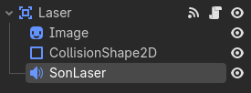
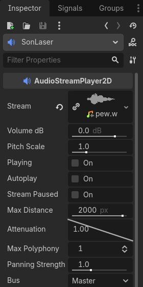
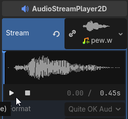

# Ajouter un effet sonore

## Introduction
Dans ce tutoriel, nous allons apprendre à ajouter un effet sonore à notre projet. Les effets sonores peuvent améliorer l'expérience utilisateur en ajoutant une dimension auditive à votre application ou jeu.

Nous allons partir du projet [`Chasseurs du vide`](../chasseurs_du_vide/) et ajouter un effet sonore lorsque que le vaisseau tire. Par la suite, tu seras en mesure d'ajouter d'autres effets sonores à différents événements de ton projet.

!!! note "Prérequis"
    Assures-toi d'avoir suivi les étapes du projet [`Chasseurs du vide`](../chasseurs_du_vide/) avant de commencer ce tutoriel. Ou du moins, être à l'aise avec les concepts de Godot.


---

## Étape 1 : Récupérer un effet sonore

!!! note "Si tu pars de rien"
    Cette étape est optionnelle si tu démarres avec le projet [`Chasseurs du vide`](../chasseurs_du_vide/) car tu as déjà un effet sonore de tir de vaisseau spatial dans le dossier `assets/sounds`. Cependant, si tu souhaites utiliser un autre effet sonore ou si tu démarres un projet différent, cette étape est pour toi.

Tout d'abord, nous allons récupérer un effet sonore pour notre vaisseau. Tu peux trouver des effets sonores gratuits sur des sites comme [101Soundboards.com](https://www.101soundboards.com/search/laser). Recherches un effet sonore de tir de vaisseau spatial ou quelque chose de similaire.

Une fois que tu as trouvé un effet sonore qui te plaît, télécharge-le et enregistre-le dans le dossier `assets/sounds` de ton projet.

---

## Étape 2 : Ajouter un nœud AudioStreamPlayer à la scène Laser

Dans le dossier `scenes`, ouvre la scène `laser.tscn`. Nous allons ajouter un nœud `AudioStreamPlayer2D` à cette scène.

1. Choisis le nœud `Laser`.
2. Clique sur le bouton "Ajouter un nœud enfant".
3. Recherches `AudioStreamPlayer2D` et sélectionne-le.
    - En tapant, il devrait apparaître dans la liste. Sélectionne-le et clique sur "Créer".
4. Renomme le nœud en `SonLaser`.

    Voici à quoi devrait ressembler ta hiérarchie de nœuds après cette étape :

    

5. Recherche l'effet sonore `pew.wav` dans le dossier `assets/sounds` et glisse-le dans la propriété `Stream` du nœud `SonLaser`.
   
    

6. Tu peux écouter le son en cliquant sur le graphique du son dans la propriété `Stream` et en appuyant sur le bouton de lecture.
   
    

---

## Étape 3 : Jouer le son lorsque le laser est tiré
Maintenant que nous avons ajouté le nœud `SonLaser` et configuré l'effet sonore, nous allons faire en sorte que le son soit joué chaque fois que le laser est tiré.

1. Ouvre le script `laser.gd` attaché au nœud `Laser`.
    - Clique sur l'icône du parchemin à côté du nœud `Laser` pour ouvrir le script.
2. Ajoute une variable pour référencer le nœud `SonLaser` en haut du script vers la ligne 9 :
    
    ```gdscript
    @onready var son := $SonLaser
    ```   
3. Ensuite, modifie le contenu de la fonction `_ready()` pour inclure une ligne qui joue le son lorsque le laser est tiré. Voici à quoi devrait ressembler la fonction `_ready()` après la modification :

    ```gdscript
    func _ready() -> void:
        son.finished.connect(son_termine)
        son.play()
    ```
4. À la fin, il faudra ajouter la fonction `son_termine()` pour faire disparaître le laser une fois que le son est terminé. Ajoute cette fonction à la fin du script `laser.gd` :

    ```gdscript
    func son_termine() -> void:
        queue_free()
    ```
5. Tu peux tester en lançant le projet.

!!! Note "Remarque"
    Lorsque le laser touche une météorite, le son est tronqué. C'est parce que le nœud `SonLaser` est un enfant du nœud `Laser`, et lorsque le laser est détruit, tous ses enfants sont également détruits, y compris le nœud `SonLaser` qui joue le son. Nous allons résoudre ce problème.

6. Dans la fonction `_on_body_entered(body)`, modifie la ligne qui détruit le laser soit `queue_free()` pour `visible = false`. Ainsi, le laser ne sera plus visible mais le nœud `SonLaser` continuera à jouer le son jusqu'à la fin.

    Voici à quoi devrait ressembler la fonction `_on_body_entered(body)` après la modification :

    ```gdscript
    func _on_body_entered(body: Node2D) -> void:
        if (body is Meteorite):
            body.appliquer_dommage(10, Vector2.UP.rotated(rotation) * vitesse / 10)
        
            visible = false
    ```

7. Teste à nouveau le projet pour vérifier que le son du laser est joué jusqu'à la fin même lorsque le laser touche une météorite.

---

### Étape optionnelle : Configurer les propriétés du SonLaser
Si tu le souhaites, tu peux ajuster les propriétés du nœud `SonLaser` pour personnaliser le son. Par exemple, tu peux ajuster la hauteur du son en modifiant la propriété `Pitch Scale` ou régler le volume en modifiant la propriété `Volume Db`. N'hésite pas à expérimenter avec ces paramètres pour obtenir le son que tu souhaites.

