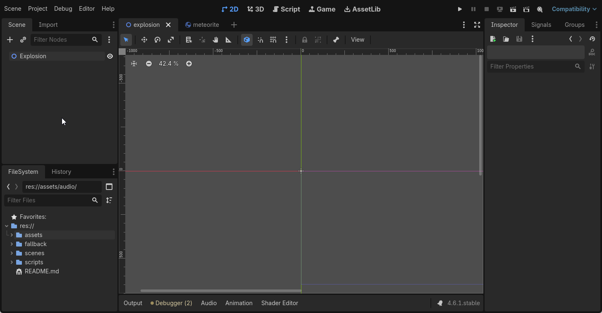
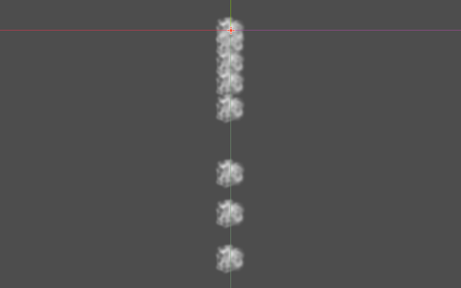
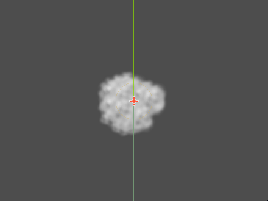
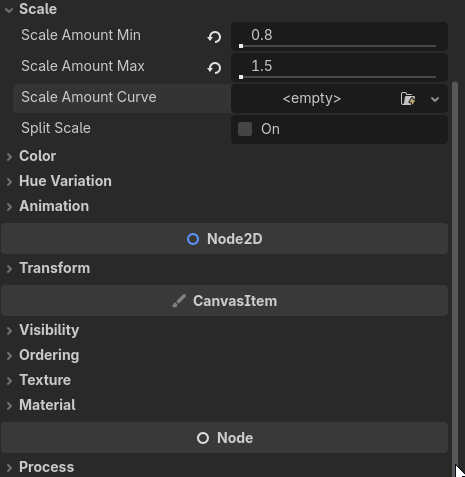
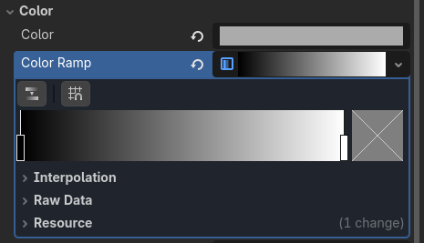
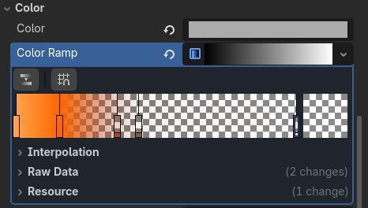
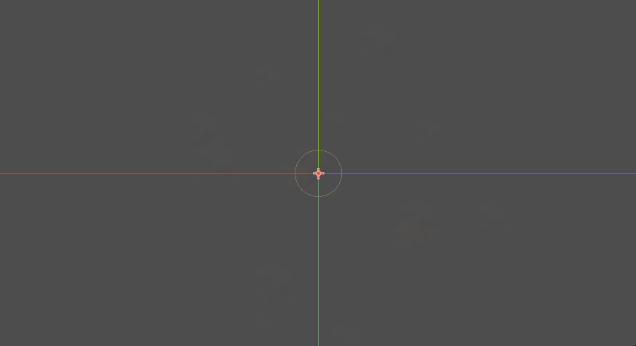
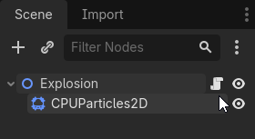

# Ateliers numéro 5 : Les chasseurs du vide

## Objectifs
Ajouter des effets spéciaux sur un jeu déjà existant.

## Prérequis

- Être familié à l'environnement Godot
- Avoir déjà fait quelques projets dans Godot
- Télécharger le fichier "void-hunters.zip"

---

!!! note "Dépannage"
    
    Si ton Godot Web ne semble plus fonctionner ou est instable, va voir la [page de dépannage](../depannage/index.md) pour voir les étapes à suivre pour régler le problème.

---

## Introduction


Dans cet atelier, nous allons démarrer avec le projet nommé "Void Hunters". Il s'agit d'un jeu où l'on contrôle un vaisseau spatial et l'on doit détruire des météorites avant qu'ils viennent s'abattre sur nous. L'objectif est de détruire le plus de météorites en moins de 120 secondes sans être détruit.


---

## Étape 1 : Importer et installer le projet

1. Dans ton navigateur, va à l'adresse suivante : [https://tinyurl.com/ateliers-jeux](https://tinyurl.com/ateliers-jeux) et télécharge le fichier `void-hunters.zip`.
2. Démarre l'environnement de développement Godot.
    - Si tu es sur un ChromeBook, tu peux utiliser la version en ligne de Godot : [https://editor.godotengine.org/](https://editor.godotengine.org/).
3. Importe le fichier `void-hunters.zip` dans l'environnement Godot

    

4. Donne au projet le nom que tu désires. Par exemple dans mon cas, j'ai écrit "Chasseurs du vide".

    

6. Clique sur "Installer"

---

## Étape 2 : Comprendre le projet
Le projet est déjà fonctionnel, tu peux cliquer sur "Play" pour le tester. Tu devrais voir une scène avec un vaisseau spatial au centre de l'écran et des météorites qui s'avancent vers toi. Ton objectif est de détruire les météorites en tirant dessus avec ton vaisseau.


Sauf que tu remarques qu'il manque un petit quelque chose. Le jeu est un peu fade, il n'y a pas d'effets spéciaux lorsque tu détruis les météorites. C'est ce que nous allons ajouter dans cet atelier.

L'ajout d'effets spéciaux rendra le jeu plus immersif et plus amusant à jouer. Nous allons ajouter une explosion lorsque tu détruis une météorite, ainsi que des particules de fumée pour rendre l'explosion plus réaliste.

Les effets spéciaux sont importants dans les jeux vidéo car ils améliorent l'expérience de jeu en rendant les actions plus visuellement intéressantes. Ils peuvent également aider à transmettre des informations au joueur, comme le fait que tu as réussi à détruire une météorite.

### Les fichiers d'intérêt
Voici les fichiers qui nous intéressent pour cet atelier :

- `scenes/monde.tscn` : C'est la scène principale du jeu, c'est là que tout se passe.
- `scenes/meteorite.tscn` : C'est la scène qui représente les météorites et où nous allons programmer l'explosion.
- `scenes/explosion.tscn` : C'est la scène qui représentera l'explosion lorsque tu détruis une météorite.
- `assets/sprites/smoke_particle.png` : C'est l'image qui sera utilisée pour les particules de fumée de l'explosion.

---

## Étape 3 : Créer la scène de l'explosion

Ouvre la scène `scenes/explosion.tscn` dans l'éditeur de Godot.



Pour l'instant, il n'y a rien. Il ne s'agit que d'un noeud `Node2D` vide. Nous allons ajouter les éléments nécessaires.

1. Ajoute un noeud enfant de type `CPUParticles2D` au noeud `Explosion`.
2. Zoom un peu pour mieux voir la scène.
3. Tu devrais voir des particules tombées du centre de la scène. C'est le comportement par défaut des particules.

> Qu'est-ce que sont les particules? Les particules sont de petits éléments graphiques qui peuvent être utilisés pour créer des effets spéciaux comme des explosions, de la fumée, de la pluie, etc. Elles sont généralement utilisées pour simuler des phénomènes naturels ou des effets visuels qui seraient difficiles à créer avec des sprites traditionnels.
>
> 

Maintenant, il va falloir se concentrer sur les propriétés du noeud `CPUParticles2D` qui sont dans l'inspecteur à droite de l'écran. 

4. Recherche l'image `smoke_particle.png` dans le dossier `assets/sprites` et glisse-la dans la propriété `Texture` du noeud `CPUParticles2D`.
    - Tu devrais voir les particules changer pour ressembler à des petites taches de fumée. C'est un bon début, mais il y a encore beaucoup de travail à faire pour que cela ressemble à une explosion réaliste.
    
5. Change la propriété `Amount` à 16 pour augmenter le nombre de particules émises.
6. Change la propriété `Lifetime` à 2.0 pour que les particules restent à l'écran plus longtemps.
7. Mets la propriété `Explosiveness` à 1.0 pour que les particules soient émises en une seule explosion plutôt que de manière continue.
    - Tu devrais ne voir qu'une seule particule émise au lieu de plusieurs. C'est un bon signe, cela signifie que les particules sont maintenant émises en une seule explosion.
8. `Randomness` à 0.5 pour ajouter un peu de variation dans la durée de vie des particules.
9. Dans `Emission Shape`, change la propriété `Shape` pour `Sphere surface` pour que les particules soient émises à partir de la surface d'une sphère plutôt que du centre de la scène.
    - Tu devrais voir les particules s'éloigner du centre de la scène, ce qui est plus réaliste pour une explosion.
10. Change la propriété `Radius` à `30` pour augmenter la taille de la sphère d'émission.
11. Dans `Direction`, change la propriété `Direction` à `x = 0, y = 0` pour que les particules soient émises dans toutes les directions.
12. `Spread` à 180 pour que les particules soient émises dans toutes les directions.
13. Étant donné que c'est un jeu spatial, il n'y a pas de gravité, donc change la propriété `Gravity` à `x = 0, y = 0` pour que les particules ne soient pas attirées vers le bas.
14. `Initial Velocity` pour le maximum à 200 pour que les particules soient émises à une vitesse plus rapide.
     - Tu devrais voir les particules s'éloigner plus rapidement du centre de la scène, ce qui est plus réaliste pour une explosion.
     
15. Dans `Scale`, change la propriété `Scale Amount Min` à 0.8 et `Scale Amount Max` à 1.5 pour que les particules aient des tailles variées.
     - `Scale` c'est le terme mathématique qui veut dire "échelle" en français.  
16. On va ajouter ce qu'on appelle une courbe d'échelle pour faire varier la taille des particules au cours de leur vie. Cliquer sur le mot `<empty>` à côté de `Scale Amount Curve` pour ouvrir l'éditeur de courbe.
17. Sélectionne `Curve` dans le menu déroulant pour créer une nouvelle courbe.
     - 
18. Clic dans le graphique et déplace le premier pour à environ (0, 0.6)
19. Mets le deuxième point à environ (0.7, 1.0)
20. Mets un dernier point à (1.0, 0.0)
     - Tu devrais voir les particules commencer à une taille plus petite, puis grandir pour atteindre leur taille maximale avant de rétrécir à nouveau jusqu'à disparaître.
     
21. Maintenant place à la couleur! Nous allons faire un gradient de couleur pour faire varier la couleur des particules au cours de leur vie.
22. Change la couleur pour mettre un gris plus pâle au lieu de blanc.
23. Clique sur le mot `<empty>` à côté de `Color Ramp` pour ouvrir l'éditeur de gradient de couleur.
24. Sélectionne `Gradient` dans le menu déroulant pour créer une nouvelle courbe de couleur.
    
    - > Un gradient de couleur est une transition progressive entre deux ou plusieurs couleurs. Dans le cas que l'on observe dans l'image, cela passerait du noir au blanc en passant par différentes nuances de gris.
25. Dans l'échelle de gradient, double-clique sur le premier rectangle pour changer la couleur noir et la mettre orange-jaune.
    - Dans le champ `Hex` de la fenêtre de sélection de couleur, entre `ffa248` pour obtenir la bonne teinte d'orange-jaune.
26. Double-clique sur le deuxième rectangle à la fin pour mettre la valeur `ffffff15` pour faire disparaître les particules à la fin de leur vie.
    - `ffffff15` est une couleur blanche avec une faible opacité.
27. Ajoute un point à environ 20% de la ligne de gradient et mets la valeur `ff6600` pour obtenir une teinte d'orange plus foncé.
28. Ajoute un point à environ 35% de la ligne de gradient et mets la valeur `ad472b3b` pour obtenir une teinte de rouge avec une certaine opacité.
29. Ajoute un point à environ 40% de la ligne de gradient et mets la valeur `835c3314` pour obtenir une teinte de brun avec une faible opacité.
    - Tu devrais voir les particules commencer avec une couleur orange-jaune, puis devenir plus foncées avant de disparaître complètement.
    



L'explosion est pratiquement terminée! Il ne reste qu'à la configurer pour qu'elle s'arrête d'émettre des particules après une seule explosion.

30. Décoche la case `Emitting` pour que les particules ne soient pas émises en continu. Il s'agit de la première propriété dans l'inspecteur du noeud `CPUParticles2D`.
31. Coche la case `One Shot` pour que les particules soient émises en une seule explosion.
    - Maintenant, les particules ne seront émises qu'une seule fois lorsque l'explosion sera déclenchée, ce qui est exactement ce que nous voulons pour une explosion réaliste.

## Étape 4 : Programmer l'explosion
Il faut maintenant ajouter le code nécessaire pour que l'explosion soit déclenchée lorsque tu détruis une météorite.

1. Repère le fichier `scripts/explosion.gd`
2. Prends le et glisse-le sur le noeud `Explosion` dans la scène `explosion.tscn` pour l'attacher à ce noeud.
3. Tu devrais voir un petit icône de script apparaître à côté du noeud `Explosion` dans l'arborescence de la scène, ce qui signifie que le script est maintenant attaché à ce noeud.



Voici le contenu du script `explosion.gd` :

```gdscript
extends Node2D

func _ready() -> void:

	# Charge les particules d'explosion
	var particles := $CPUParticles2D

	# Valider que les particules sont présentes
	if particles == null:
		return

	# Configure les particules pour qu'elles soient jouées une seule fois
	particles.one_shot = true

	# Connecte le signal "finished" à la fonction de rappel `_on_finished`
	# `finished` est émis lorsque les particules ont terminé de jouer
	particles.finished.connect(_on_finished)

	# Démarre les particules d'explosion
	particles.restart()

func _on_finished() -> void:
	queue_free()
```

## Étape 5 : Attacher l'explosion à la météorite
Maintenant que nous avons créé la scène de l'explosion et programmé son comportement, il est temps de l'attacher à la scène de la météorite pour que l'explosion soit déclenchée lorsque tu détruis une météorite.

1. Ouvre la scène `scenes/meteorite.tscn`.
2. Ouvre le script qui est déjà attaché au noeud `Meteorite` dans cette scène. Il s'agit du fichier `scripts/meteorite.gd`.
3. Repère la fonction `func reset()` dans ce script.
    - Ça devrait être aux alentours de la ligne 95.
4. Ajoute une ligne vide avant la fonction.
5. Ajoute ce code juste avant la fonction `reset()` :

```gdscript
func faire_exploser() -> void:
	var explosion_instance := explosion_scene.instantiate() as Node2D
	explosion_instance.position = position
	get_parent().add_child(explosion_instance)
```

6. Repère la fonction `func detruire()` dans le même script.
    - Environ à la ligne 85
7. Dans la fonction `detruire()`, ajoute la ligne suivante juste avant `if pool != null:` :

```gdscript
    faire_exploser()
```

Si tout est en ordre, tu ne devrais pas avoir d'erreur de compilation. 

> **En cas d'erreur :**
> 
> Si tu as une erreur, vas dans le dossier `fallback`. Tu peux comparer les fonctions `detruire()` et `faire_exploser()` dans le fichier `meteorite_explosion.txt` avec les tiennes pour voir ce qui ne va pas.
>
> ou encore tu peux prendre le fichier `meteorite_complet.txt` et remplacer tout le contenu de ton fichier `meteorite.gd` par celui du fichier `meteorite_complet.txt` pour être sûr que tout est correct.