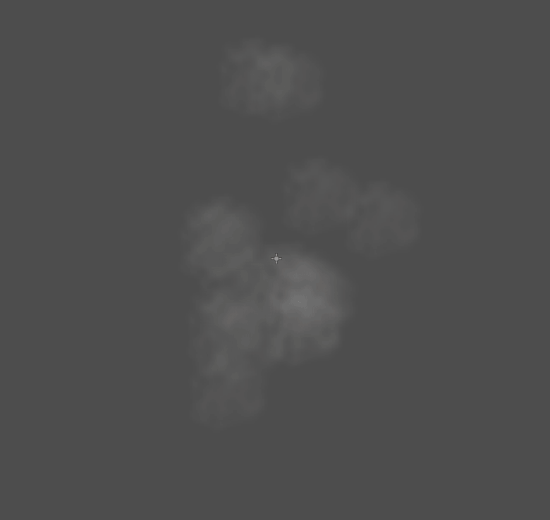
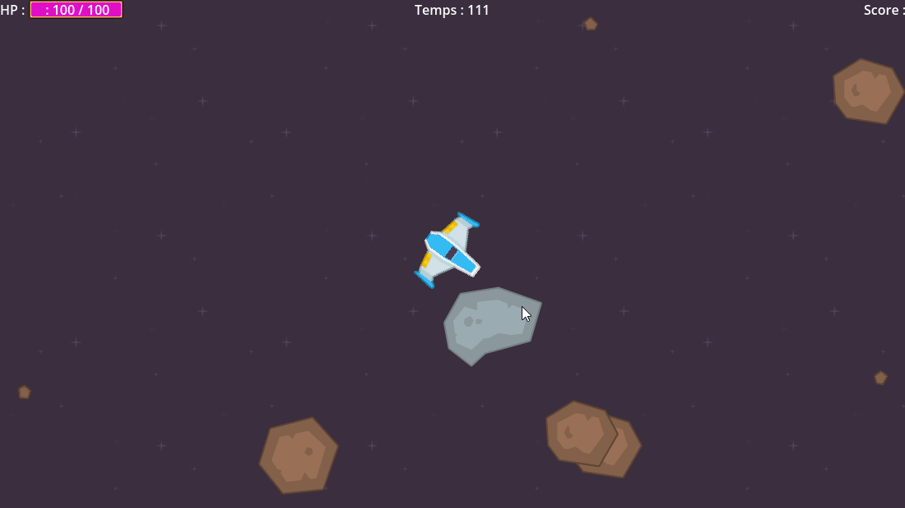
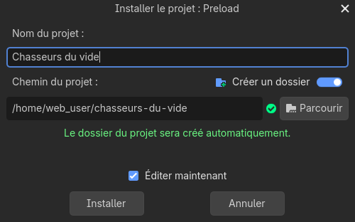
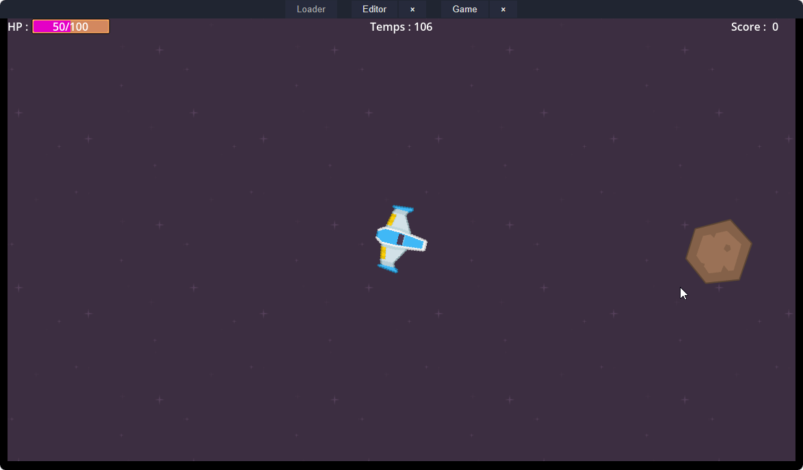

# Ateliers numéro 5 : Les chasseurs du vide

## Objectifs
Ajouter des effets spéciaux sur un jeu déjà existant.

## Prérequis

- Être familié à l'environnement Godot
- Avoir déjà fait quelques projets dans Godot
- Télécharger le fichier "void-hunters.zip" **TODO**

---

## Introduction

Dans cet atelier, nous allons démarrer avec le projet nommé "Void Hunters". Il s'agit d'un jeu où l'on contrôle un vaisseau spatial et l'on doit détruire des astéroïdes avant qu'ils viennent s'abattre sur nous. L'objectif est de détruire le plus d'astéroïdes en moins de 120 secondes sans être détruit.

---

## Étape 1 : Importer et installer le projet

1. Dans ton navigateur, va à l'adresse suivante : [https://tinyurl.com/ateliers-jeux](https://tinyurl.com/ateliers-jeux) et télécharge le fichier `void-hunters.zip`.
2. Démarre l'environnement de développement Godot.
    - Si tu es sur un ChromeBook, tu peux utiliser la version en ligne de Godot : [https://editor.godotengine.org/](https://editor.godotengine.org/).
3. Importe le fichier `void-hunters.zip` dans l'environnement Godot

    
4. Donne au projet le nom que tu désires. Par exemple dans mon cas, j'ai écrit "Chasseurs du vide".

    
6. Clique sur "Installer"

---

## Étape 2 : Comprendre le projet
Le projet est déjà fonctionnel, tu peux cliquer sur "Play" pour le tester. Tu devrais voir une scène avec un vaisseau spatial au centre de l'écran et des astéroïdes qui s'avancent vers toi. Ton objectif est de détruire les astéroïdes en tirant dessus avec ton vaisseau.

Sauf que tu remarques qu'il manque un petit quelque chose. Le jeu est un peu fade, il n'y a pas d'effets spéciaux lorsque tu détruis les astéroïdes. C'est ce que nous allons ajouter dans cet atelier.

