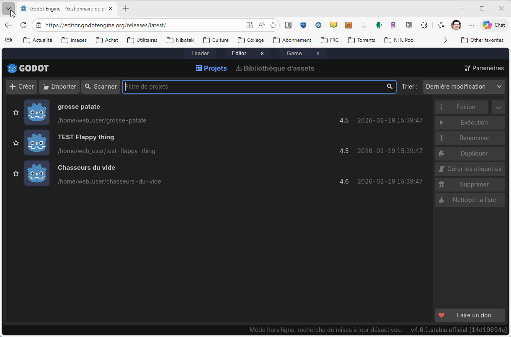

# Page pour le dépannage des ateliers

## Godot

### Godot ne répond plus ou est instable

1. Rafraîchis la page
2. Sans récupérer le fichier du projet, clique dessus le bouton `Start Godot Editor`
3. Dans la liste qui s'affiche, sélectionne le projet et clique sur le bouton `Édition`.
4. Tu pourras partir d'où tu en étais rendu.

