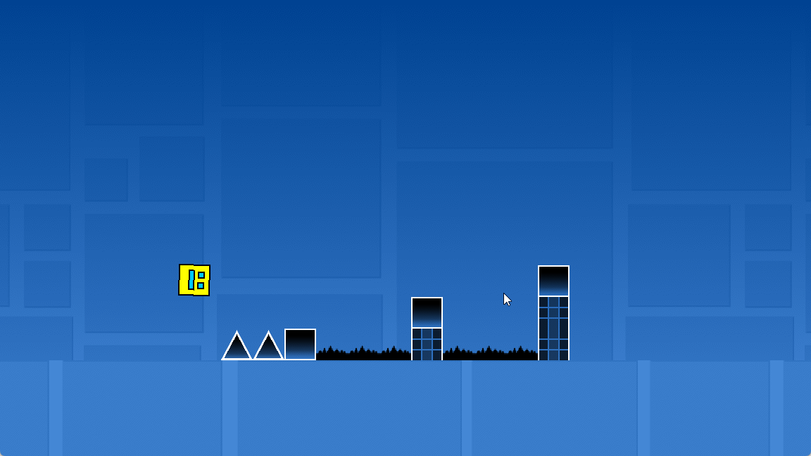
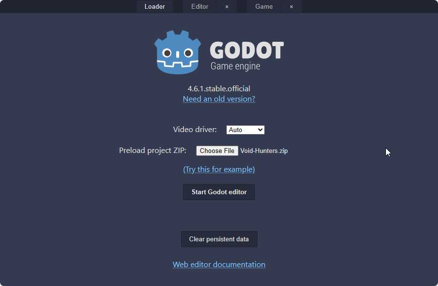
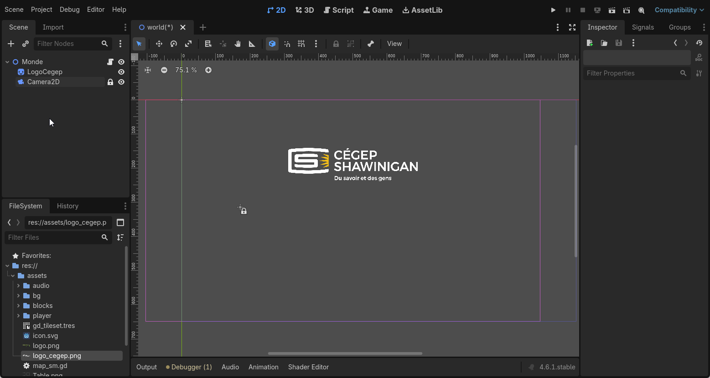

# Atelier numéro 6 : Clone d'un Geometry Dash

## Objectifs
L'objectif de cet atelier est de créer un clone du célèbre jeu "Geometry Dash". On ne fera pas le jeu complet, mais on se concentrera sur les éléments de base : le personnage principal du premier niveau, les obstacles et la mécanique de saut.

---

## Prérequis

- Être familié à l'environnement Godot
- Avoir déjà fait quelques projets dans Godot
- Télécharger le fichier "void-hunters.zip"

!!! note "Dépannage"
    
    Si ton Godot Web ne semble plus fonctionner ou est instable, va voir la [page de dépannage](../depannage/index.md){target=_blank} pour voir les étapes à suivre pour régler le problème.

---

## Introduction

Suite la proposition d'un élève, j'ai décidé de faire un atelier sur la création d'un clone de "Geometry Dash". Je crois que la majorité des élèves connaissent ce jeu, et il est assez simple à comprendre, il ne suffit que de sauter pour éviter les obstacles.

<video controls src="assets/10_demo.mp4" title="Title"></video>

Je vais fournir une base de projet avec les éléments graphiques et les sons nécessaires pour créer le jeu. Nous allons nous concentrer sur la mécanique de saut et la création des obstacles, ainsi que sur la gestion de la collision entre le personnage et les obstacles.

---

## Étape 1 : Importer et installer le projet

1. Dans ton navigateur, va à l'adresse suivante : [https://tinyurl.com/ateliers-jeux](https://tinyurl.com/ateliers-jeux){target=_blank} et télécharge le fichier `PolygonDash.zip`.
2. Démarre l'environnement de développement Godot.
    - Si tu es sur un ChromeBook, tu peux utiliser la version en ligne de Godot : [https://editor.godotengine.org/](https://editor.godotengine.org/){target=_blank}.
3. Importe le fichier `PolygonDash.zip` dans l'environnement Godot

    

4. Donne au projet le nom que tu désires. 
5. Clique sur "Installer"

---

## Étape 2 : Comprendre la structure du projet
La scène principale du projet est `monde.tscn`. C'est à partir de cette scène que le jeu est lancé.

Nous allons travailler avec principalement 3 éléments dans ce projet :
- `monde.tscn` : la scène principale du jeu, qui contient les éléments de base du niveau.
- `joueur.tscn` : la scène du personnage principal, qui contient les éléments graphiques et le script de contrôle du personnage.
- `level.tscn` : la scène qui contient les éléments graphiques du niveau, comme les obstacles et les plateformes.

---

## Étape 3 : Ajouter le joueur

---

## Étape 4 : Ajouter le level

---

## Étape 5 : Ajouter le code du joueur

---

## Étape 6 : Ajouter les obstacles

---

## Finaliser le projet

TODO : Liste des étapes à rédiger
- Level
  - Retirer le contenu de TileMapLayer
  - Retirer le code pour sol_mortel
  - Retirer le script de la musique
- Joueur
  - Laisser les noeuds
  - Retirer le script
- Extra
  - Indiquer que pour ceux que ça intéresse, les positions des tuiles du niveau "Stereo Madness" sont disponibles dans le fichier `assets/map_sm.gd`

---