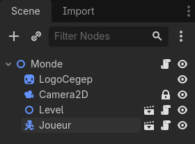
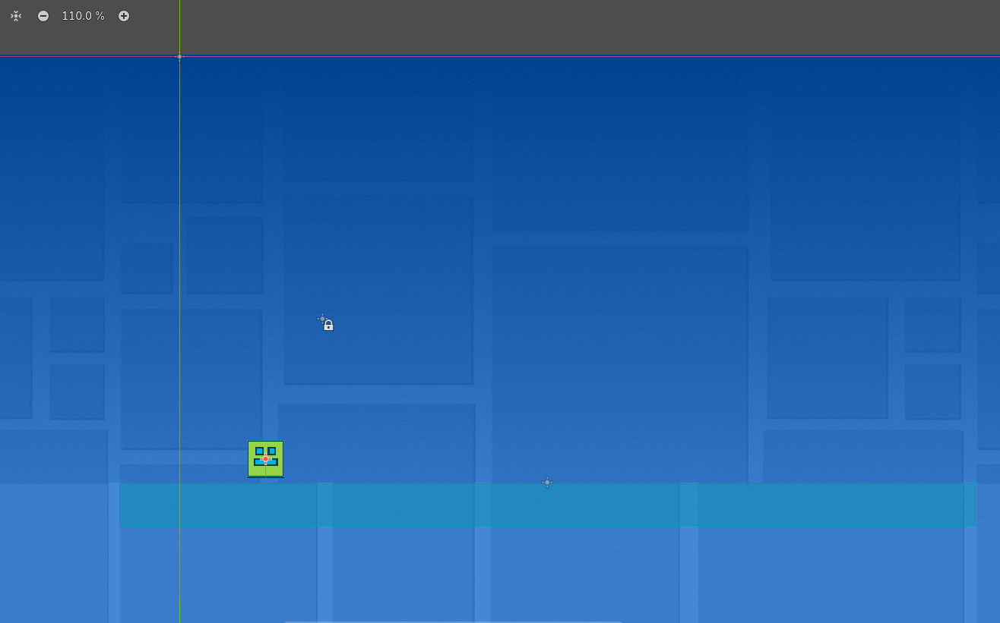
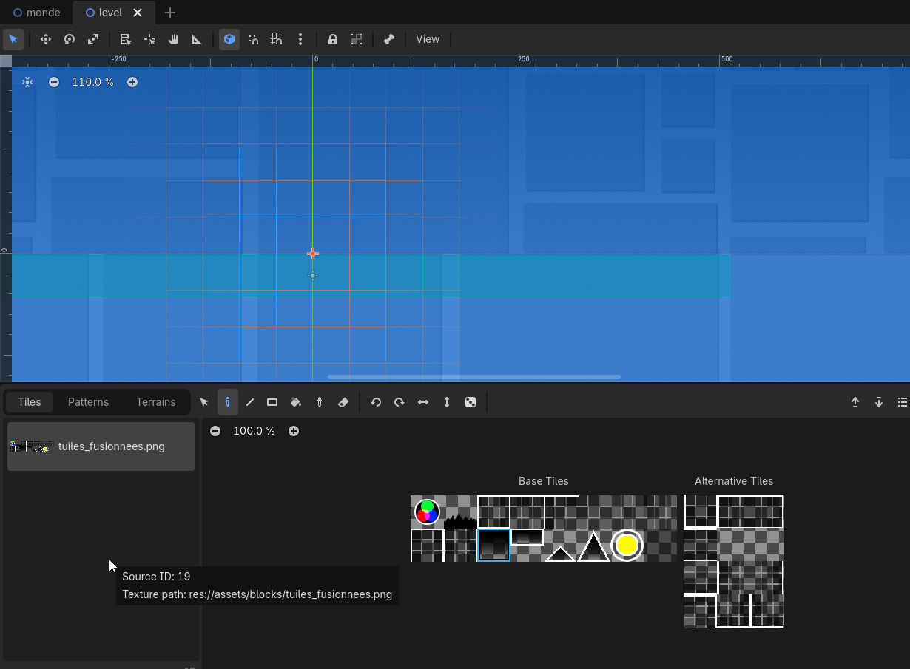
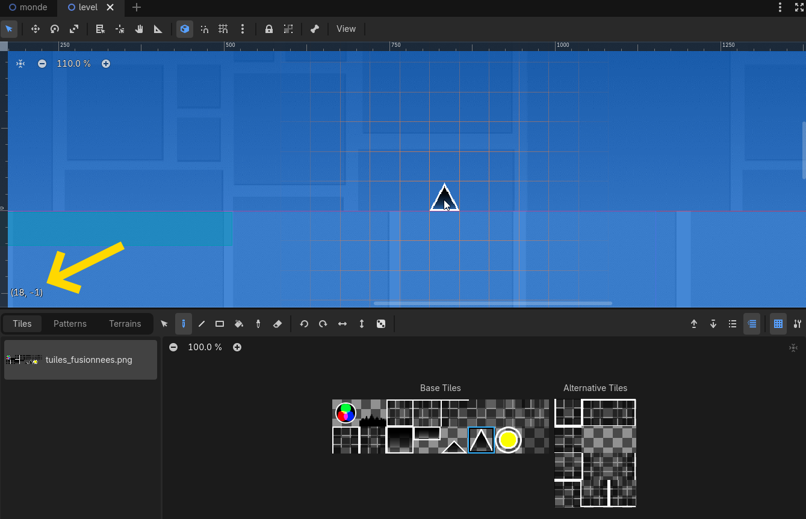

# Atelier numéro 6 : Clone d'un Geometry Dash


## Objectifs
L'objectif de cet atelier est de créer un clone du célèbre jeu "Geometry Dash". On ne fera pas le jeu complet, mais on se concentrera sur les éléments de base : le personnage principal du premier niveau, les obstacles et la mécanique de saut.

---

## Prérequis

- Être familié à l'environnement Godot
- Avoir déjà fait quelques projets dans Godot
- Télécharger le fichier "PolygonDash.zip"


!!! note "Dépannage"
    
    Si ton Godot Web ne semble plus fonctionner ou est instable, va voir la [page de dépannage](../depannage/index.md){target=_blank} pour voir les étapes à suivre pour régler le problème.

---

## Introduction

Suite la proposition d'un élève, j'ai décidé de faire un atelier sur la création d'un clone de "Geometry Dash". Je crois que la majorité des élèves connaissent ce jeu, et il est assez simple à comprendre, il ne suffit que de sauter pour éviter les obstacles.

<video controls src="assets/10_demo.mp4" title="Title" autoplay loop></video>

Je vais fournir une base de projet avec les éléments graphiques et les sons nécessaires pour créer le jeu. Nous allons nous concentrer sur la mécanique de saut et la création des obstacles, ainsi que sur la gestion de la collision entre le personnage et les obstacles.

---

## Étape 1 : Importer et installer le projet

1. Dans ton navigateur, va à l'adresse suivante : [https://tinyurl.com/ateliers-jeux](https://tinyurl.com/ateliers-jeux){target=_blank} et télécharge le fichier `PolygonDash.zip`.
2. Démarre l'environnement de développement Godot.
    - Si tu es sur un ChromeBook, tu peux utiliser la version en ligne de Godot : [https://editor.godotengine.org/](https://editor.godotengine.org/){target=_blank}.
3. Importe le fichier `PolygonDash.zip` dans l'environnement Godot

    

4. Donne au projet le nom que tu désires. 
5. Clique sur "Installer"

---

## Étape 2 : Comprendre la structure du projet
La scène principale du projet est `monde.tscn`. C'est à partir de cette scène que le jeu est lancé.


Nous allons travailler avec principalement 3 éléments dans ce projet :

- `monde.tscn` : la scène principale du jeu, qui contient les éléments de base du niveau.
- `joueur.tscn` : la scène du personnage principal, qui contient les éléments graphiques et le script de contrôle du personnage.
- `level.tscn` : la scène qui contient les éléments graphiques du niveau, comme les obstacles et les plateformes.

---

## Étape 3 : Ajouter les éléments de base du projet
Dans cette étape, nous allons ajouter les éléments de base du projet, comme le personnage principal et le niveau.

- Ouvre la scène `monde.tscn` 
- Ajoute la scène `level.tscn` à la scène `monde.tscn`
   - Place le level pour que le haut du level soit à égalité avec l'axe horizontal du monde.
   - Dans mon cas, j'ai placé le level à la position (440, 510)
- Ajoute la scène `joueur.tscn` à la scène `monde.tscn`
   - Place le joueur pour qu'il soit au-dessus du sol. Il y a une démarcation pour le sol dans le level.

Voici la structure de la scène `monde.tscn` après avoir ajouté les éléments de base :


Voilà à quoi devrait ressembler la scène `monde.tscn` après avoir ajouté les éléments de base :


-- **Test le jeu.** Tu devrais voir le personnage principal et le niveau, mais tu ne devrais pas pouvoir faire grand chose pour l'instant.

> Note : J'ai programmé la touche "R" pour permettre de recommencer rapidement.

---

## Étape 4 : Ajouter le code du joueur
Dans cette étape, nous allons ajouter le code de contrôle du personnage principal. Il y a déjà un script attaché au personnage, mais il manque le code pour déplacer le personnage et pour gérer les sauts. Nous allons ajouter ce code dans le script `joueur.gd`.

- Ouvre le script `joueur.gd`
- Repère la fonction `_physics_process(delta : float) -> void`
   - Elle devrait se situer à la fin du script. <!-- TODO : Modifier la branche Main pour refléter ceci -->

!!! note "Explication de la fonction `_physics_process`"
    La fonction `_physics_process` est appelée à chaque frame du jeu. On se rappelle que les jeux vidéo fonctionnent comme les anciennes animations : ils affichent une série d'images à une vitesse suffisamment rapide pour que notre cerveau les perçoive comme un mouvement fluide. Cette fonction est appelée 60 fois par seconde, ce qui correspond à une vitesse de 60 images par seconde (60 FPS).

- Supprime le bloc de la fonction `_physics_process`.
    - Nous allons la remplacer par une nouvelle version qui contient le code de contrôle du personnage.
- Ouvre le fichier `fallback/joueur_phys_proc.txt`
- Copie le contenu du fichier `joueur_phys_proc.txt`
    - Tu te rappelles? Pour sélectionner tout le contenu d'un fichier, tu peux cliquer n'importe où dans le fichier et faire `Ctrl + A` pour sélectionner tout le contenu, puis `Ctrl + C` pour copier le contenu sélectionné.
- Colle le contenu dans le script `joueur.gd` à la place de la fonction `_physics_process` que tu viens de supprimer.
    - Pour coller le contenu, tu peux faire `Ctrl + V` pour coller le contenu que tu as copié.

Voici le contenu de la fonction `_physics_process` que tu devrais avoir après avoir collé le code :

```gdscript
func _physics_process(delta: float) -> void:
	detect_sol.rotation_degrees = -rotation_degrees
	var au_sol : bool = detect_sol.is_colliding() or is_on_floor()
	
	if au_sol:
		if sol_mortel():
			mort()
			
		velocity.y += gravite * delta
		if Input.is_action_just_pressed("jump"):
			velocity.y += saut_force

		# Permet de "snapper" la rotation du joueur à des angles de 90 degrés lorsqu'il est au sol
		#rotation_degrees = round(rotation_degrees / (90.0)) * 90.0

		#modulate = Color(1, 1, 1) # Normal color when on the ground
	else:
		velocity.y += gravite * delta
	
		# Pivotement du joueur en l'air
		#rotation_degrees -= rotation_vitesse * rotation_mult

		#modulate = Color(1, 0.5, 0.5) # Change color when in the air

	if rotation_degrees >= 360 or rotation_degrees <= -360:
		rotation_degrees = 0.0

	velocity.x = vitesse

	if is_on_wall():
		mort()

	move_and_slide()
```

- **Test le jeu.** On veut s'assurer que le joueur se déplace vers la droite et qu'il peut sauter.

<video controls src="assets/36_jump_not_ok.mp4" title="Title" autoplay loop></video>

---

### Étape 4b : Ajouter la rotation du joueur

On remarque que le joueur ne pivote pas lorsqu'il est dans les airs, contrairement au jeu officiel. Nous allons ajouter une rotation au joueur pour qu'il pivote lorsqu'il est dans les airs.

Dans le code que tu as collé dans la fonction `_physics_process`, il y a des lignes de code qui sont commentées (elles commencent par le caractère `#`). Certaines de ces lignes de code sont responsables de la rotation du joueur lorsqu'il est dans les airs.

Vers la ligne 73, tu devrais voir la ligne `#rotation_degrees -= rotation_vitesse * rotation_mult`. Retire le caractère commentaire de cette ligne pour activer la rotation du joueur lorsqu'il est dans les airs.

```gdscript
		rotation_degrees -= rotation_vitesse * rotation_mult
```

!!! note "Explication du code de rotation"
    Cette ligne de code fait en sorte que l'on modifie la rotation du joueur en soustrayant une valeur à la rotation actuelle. La variable `rotation_vitesse` contrôle la vitesse de rotation, et la variable `rotation_mult` est un multiplicateur qui peut être utilisé pour ajuster la vitesse de rotation en fonction de certaines conditions (par exemple, on pourrait vouloir que le joueur tourne plus rapidement s'il est dans les airs pendant une longue période).

- **Test le jeu.** Le joueur devrait maintenant pivoter lorsqu'il est dans les airs, mais quelque chose ne semble pas tout à fait correct.

<video controls src="assets/37_jump_ok.mp4" title="Title" autoplay loop></video>

---

### Étape 4c : Atterir à plat
Vous remarquez que lorsque le joueur atterrit, il peut être dans une position de rotation qui n'est pas à plat, ce qui n'est pas ce à quoi on s'attendrait. Nous allons faire en sorte que le joueur atterrisse à plat, peu importe la position de rotation dans laquelle il se trouve lorsqu'il touche le sol.

Dans la fonction `_physics_process`, repèree la ligne `#rotation_degrees = round(rotation_degrees / 90.0) * 90.0` et retire le caractère commentaire de cette ligne pour activer le code qui permet au joueur d'atterrir à plat.

```gdscript
		rotation_degrees = round(rotation_degrees / 90.0) * 90.0
```

!!! note "Explication de cette ligne de code"
    Cette ligne de code arrondit la rotation du joueur à la valeur la plus proche qui est un multiple de 90 degrés. Cela signifie que lorsque le joueur atterrit, sa rotation sera ajustée pour être à plat, même s'il était dans une position de rotation différente lorsqu'il a touché le sol.

    **Attention!** Il faut utiliser `rotation_degrees` et non `rotation`, car `rotation_degrees` est exprimé en degrés, tandis que `rotation` est exprimé en ***radians***. Les fonctions de rotation dans Godot utilisent des radians, mais pour faciliter la compréhension et le calcul de la rotation, nous utilisons des degrés dans notre code.


??? note "Des radians? Mais c'est quoi ça?"
    Vous êtes habitués à voir des rotations en degrés, mais dans les ordinateurs, les rotations sont souvent représentées en radians. Un cercle complet correspond à 360 degrés, ce qui équivaut à 2 * PI radians. Par conséquent, 90 degrés correspond à HALF_PI radians (PI / 2).

    Pour les plus jeunes, vous allez voir ces notions lorsque vous serez en [5e secondaire](https://www.alloprof.qc.ca/fr/eleves/bv/mathematiques/les-angles-trigonometriques-radians-m1469), mais pour les plus avancés, vous pouvez déjà commencer à vous familiariser avec les radians.

- **Test le jeu.** Le joueur devrait maintenant atterrir à plat, peu importe la position de rotation dans laquelle il se trouve lorsqu'il touche le sol.

<video controls src="assets/38_jump_done.mp4" title="Title" autoplay loop></video>

---

## Étape 5 : Configurer la caméra
Dans cette étape, nous allons configurer la caméra pour qu'elle suive le personnage principal. Il y a déjà une caméra dans la scène `monde.tscn`, mais elle n'est pas configurée pour suivre le joueur.

- Ouvre la scène `monde.tscn`
- Ouvre le script `monde.gd`
- Repère la ligne `#joueur = $Joueur` et retire le caractère commentaire
    - Il s'agit du caractère `#` au début de la ligne. En retirant ce caractère, on active la ligne de code qui permet de référencer le joueur dans le script.
- Repère la ligne `#cam = $Camera2D` et retire le caractère commentaire

!!! note "Explication des lignes de code"
    En retirant le caractère commentaire, on active les lignes de code qui permet d'avoir une référence à la caméra et au joueur dans le script. Ces références seront nécessaires plus loin dans le script.

- Dans la fonction `_process(delta: float) -> void`, repère la ligne `#cam.global_position.x = joueur.global_position.x`
- Retire le caractère commentaire de cette ligne pour activer le code qui permet à la caméra de suivre le joueur.

```gdscript
  cam.global_position.x = joueur.global_position.x
```

!!! note "Explication de cette ligne de code"
    Cette ligne de code fait en sorte que la position globale de la caméra sur l'axe x soit égale à la position globale du joueur sur l'axe x. En d'autres termes, la caméra suivra le joueur lorsqu'il se déplacera vers la droite.
  
- **Test le jeu.** 
- La caméra devrait suivre le joueur lorsqu'il se déplace vers la droite.

Que se passe-t-il après un certain temps? (1)
{ .annotate }

1.  Le joueur tombe. Pourquoi? Parce que le plancher du niveau est limité à une certaine largeur, et que le joueur continue de se déplacer vers la droite, il finit par dépasser la limite du plancher et tombe dans le vide. Nous allons corrigé cette situation.

<video controls src="assets/35_falling.mp4" title="Title" autoplay loop></video>

---

## Étape 6 : Ajuster le plancher

- Dans le script `monde.gd`, repère les lignes `#level = $Level` et `#level.set_joueur(joueur)`
- Retire le caractère commentaire de ces lignes

> Note : Dans la classe `Level`, j'ai fait du code qui permet au plancher de se déplacer avec le joueur.

- **Test le jeu.**
- Le plancher devrait maintenant suivre le joueur, ce qui permet de continuer à jouer sans tomber.

<video controls src="assets/40_demo_jump.mp4" title="Title" autoplay loop></video>


Maintenant que la mécanique de base est en place, on peut commencer à ajouter les obstacles et les éléments graphiques du niveau pour rendre le jeu plus intéressant.

---

## Étape 7 : Ajouter les obstacles

- Ouvre la scène `level.tscn`
- Dans le volet scène, repère et sélectionne le noeud `TileMapLayer`
- Tu devrais voir une grille apparaître dans la scène
- Dans le volet inférieur `TileMap`, tu devrais voir des tuiles disponibles pour construire le niveau
  

- Sélectionne le pic, c'est la 6e tuile dans la 2e ligne.
- Dans le jeu officiel, le premier obstacle est un pic à la position (18, -1)
  

Teste le jeu après avoir ajouté le pic pour t'assurer que la collision fonctionne correctement. Le joueur devrait mourir s'il touche le pic.

Voici la position des premières tuiles du niveau "Stereo Madness" dans selon le jeu officiel :

- Pic : (18, -1), (34, -1), (49, -1), (50, -1)
- Bloc : (51, -1), (55, -2), (59, -3)
- Lit de pic : (52, -1), (53, -1), (54, -1), (56, -1), (57, -1), (58, -1)
- Petit pic : (33, -1)

---

## Finaliser le projet : Ajouter la musique
- Ouvre le scripts `level.gd`
- Repère les lignes `#music = $Music` et `#music.playing = true`
- Retire le caractère commentaire de ces lignes pour activer la musique dans le niveau.

**Teste le jeu.**
- La musique devrait maintenant jouer dans le niveau.

---

## Extra
Si vous désirez aller plus loin, les positions des tuiles du niveau "Stereo Madness" sont disponibles dans le fichier `assets/map_sm.gd`. Vous pouvez utiliser ces positions pour recréer le niveau complet dans votre projet.

---