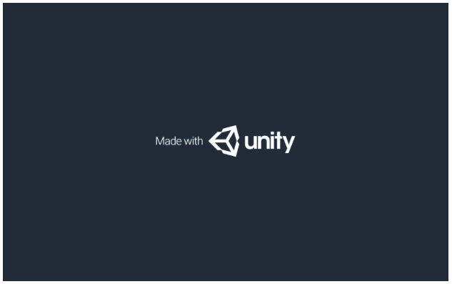
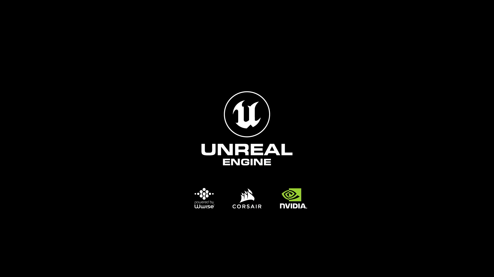
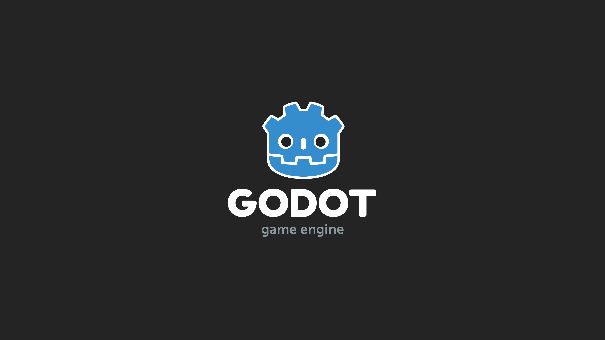
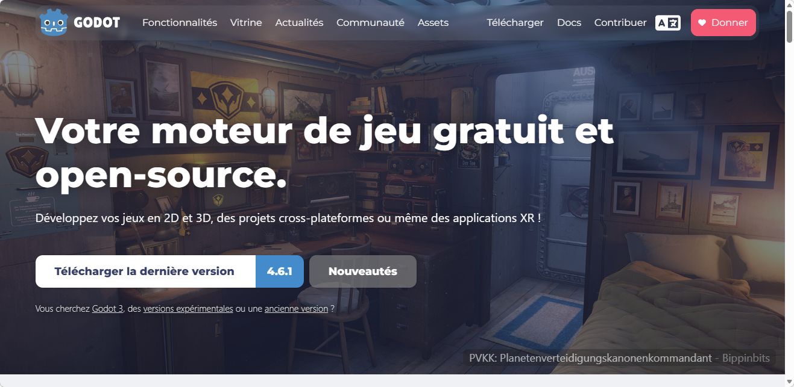
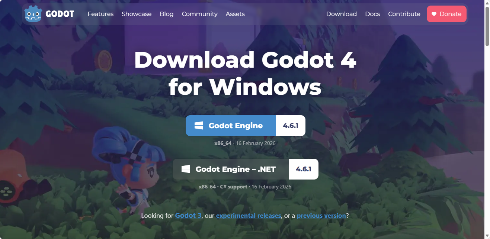
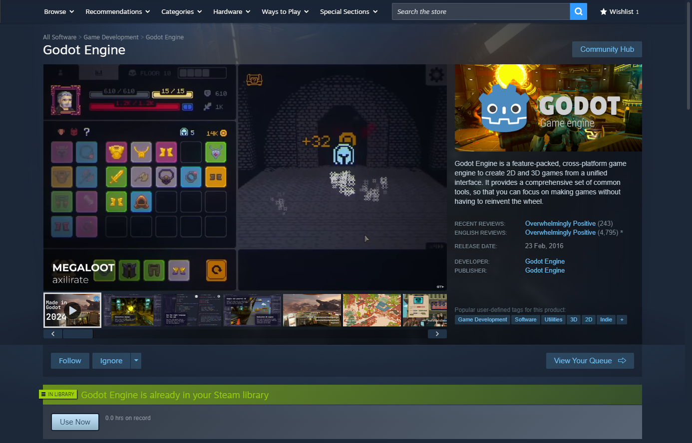
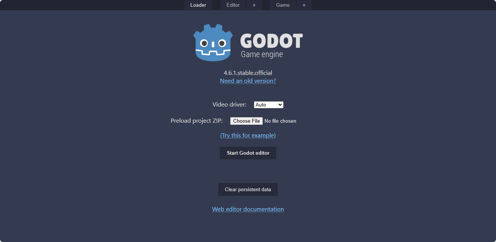

# Initiation à Godot

> **Note :** Cet article est un travail en cours, il n'est pas encore terminé. Je vais ajouter du contenu au fur et à mesure que je le crée, alors n'hésite pas à revenir régulièrement pour voir les mises à jour.
---

## Introduction
Dans cette article, nous allons découvrir le moteur de jeu Godot, un outil puissant et gratuit pour créer des jeux vidéo. Nous allons explorer les différentes façons d'installer Godot, ainsi que les fonctionnalités de base pour commencer à créer vos propres jeux.

---

## Qu'est-ce que Godot?
Lorsque tu démarres un jeu vidéo sur ta console ou ton ordinateur, tu as probablement déjà remarqué ces affiches.

Ces affiches indiquent que le jeu a été créé avec un **moteur de jeu** spécifique, comme Unity ou Unreal Engine. Godot est un autre moteur de jeu, mais contrairement à Unity et Unreal Engine, Godot est entièrement open-source et gratuit. Cela signifie que n'importe qui peut télécharger, utiliser et même contribuer au développement de Godot sans avoir à payer de frais de licence.

!!! note "Qu'est-ce qu'un moteur de jeu?"
    Un moteur de jeu est un logiciel qui fournit les outils et les fonctionnalités nécessaires pour créer des jeux vidéo. Il gère des aspects tels que le rendu graphique, la physique, l'audio, les entrées utilisateur, et bien plus encore. Les moteurs de jeu permettent aux développeurs de se concentrer sur la création du contenu du jeu plutôt que de devoir construire tous les systèmes de base à partir de zéro.

---

## Installation de Godot
Il y a plusieurs façons d'avoir accès à Godot, que ce soit en téléchargeant le logiciel sur ton ordinateur ou en utilisant une version web. Voici les différentes options pour installer ou accéder à Godot.

### Via le site officiel
La façon la plus simple d'obtenir Godot est de le télécharger directement depuis le site officiel soit https://godotengine.org/fr/. 

Il suffit de cliquer sur le bouton "Télécharger la dernière version". Ce qui vous amènera vers la page de téléchargement.

Pour le site, nous allons utiliser la version standard de Godot. Par défaut, le site te proposera de télécharger la version qui est compatible avec ton système d'exploitation. Tu n'as qu'à cliquer sur le bouton "Godot Engine" avec la version qui est inscrit dessus pour télécharger le logiciel.

Par défaut, le fichier téléchargé sera dans le dossier "Téléchargements" de ton ordinateur. Une fois le téléchargement terminé, tu peux extraire le fichier compressé (généralement un fichier .zip) et lancer l'exécutable pour commencer à utiliser Godot.

Le fichier exécutable se nomme généralement "Godot_vX.X-stable_win64.exe" où "X.X" représente la version de Godot que tu as téléchargée. Double-clique sur ce fichier pour lancer l'éditeur de Godot.

### Via Steam
Si tu utilises la plateforme de jeux Steam, tu peux également télécharger Godot directement depuis le magasin Steam. Il suffit de rechercher "Godot Engine" dans la barre de recherche de Steam, puis de cliquer sur "Installer" pour ajouter Godot à ta bibliothèque de jeux.

### Version web de Godot
Godot offre une version web de son éditeur, ce qui permet de l'utiliser directement dans un navigateur sans avoir à l'installer sur votre ordinateur. C'est une excellente option pour ceux qui veulent essayer Godot rapidement ou qui n'ont pas la possibilité d'installer des logiciels sur leur machine.

Il suffit de se rendre sur la page de la version web de Godot ici [https://editor.godotengine.org/](https://editor.godotengine.org/) et de cliquer sur le bouton "Start Godot Editor". Vous pourrez ensuite créer un nouveau projet ou ouvrir un projet existant depuis votre ordinateur.

Prends note que la version web de Godot peut être un peu plus instable que la version installée, surtout pour les projets plus complexes, mais elle est tout à fait fonctionnelle pour les projets simples et pour apprendre les bases de Godot.

Si tu rencontres des problèmes, tu peux aller à ma page de [dépannage](../depannage/index.md) pour trouver des solutions à certains problèmes courants avec la version web de Godot.

---

## Références

- TODO : Ajouter les références...