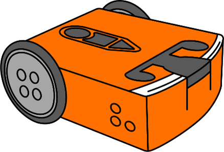
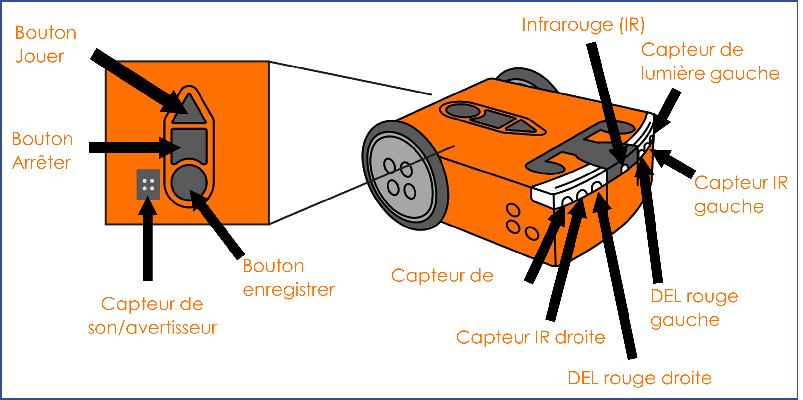
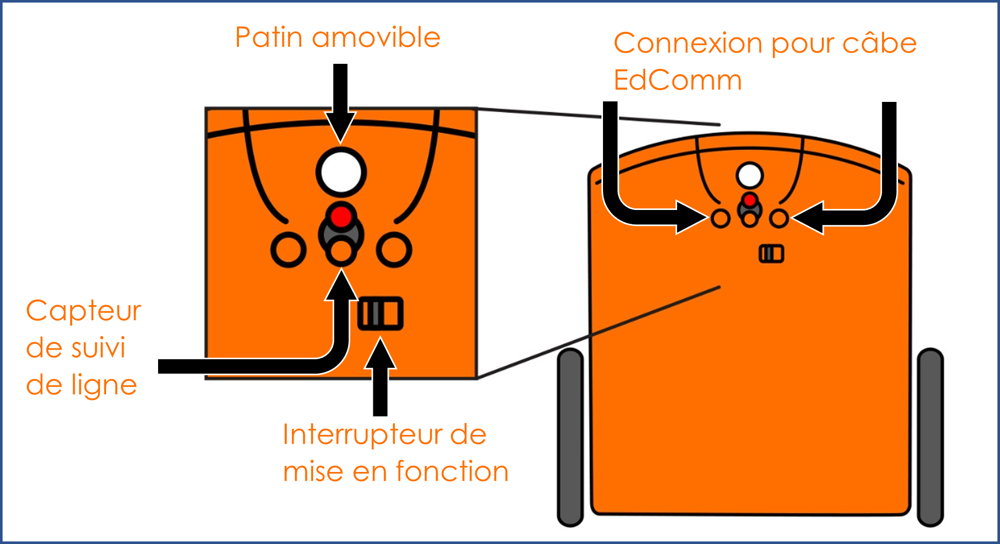

# Prise en main du robot <!-- omit in toc -->

Cette activité permet à l'élève de prendre en main le robot. On explore les différents composants du robot et on voit comment envoyer un programme au robot à l'aide du logiciel EdScratch.

---

# 1. Démarrage

## 1.1 Explorons le robot Edison
Ceci est Edison le robot programmable.

Il y a beaucoup de choses que nous pouvons faire avec nos robots Edison. Nous pouvons programmer le robot pour qu'il fasse des choses comme se déplacer à l'aide de ses moteurs, faire clignoter ses lumières LED ou émettre des sons. Nous pouvons également utiliser Edison pour construire des créations robotiques, compléter des labyrinthes et bien d'autres choses encore!  
Avant de commencer à utiliser Edison, nous devons en savoir un peu plus sur le robot.

Edison utilise des capteurs et des moteurs pour interagir avec le monde. Il possède également trois boutons, un interrupteur et plusieurs pièces amovibles. Savoir où se trouvent les pièces d'Edison et ce qu'elles font t'aidera à utiliser Edison.

---

### Tâche 01 : Regarder Edison du dessus
Regarde le dessus de ton robot Edison. Essaies de trouver toutes les pièces étiquetées sur l'image de votre robot Edison.

---

### Tâche 02 : Regarder en dessous d'Edison
Retourne Edison. Regarde l'image et essaie de trouver toutes les pièces étiquetées dans l'image sur ton robot Edison.

---

## Tâche 03 : Brancher le câble EdComm
Un composant que nous allons utiliser beaucoup avec Edison. Il s'agit du câble EdComm.

Tu utiliseras le câble EdComm pour télécharger tes programmes sur Edison à partir de ton appareil de programmation, comme ton ordinateur. Le câble EdComm est doté une connexion pour l'Edison à une extrémité, et l'autre extrémité se connecte à la prise pour écouteurs de ton ordinateur.

---

## Tâche 04 : Allumer Edison
Chaque fois que nous voulons utiliser Edison, nous devons allumer le robot. Essaie d'allumer Edison maintenant.

1. Que se passe-t-il lorsque tu allumes le robot? Décris ce qui se passe, y compris ce que tu as vu et ce que tu as entendu.

