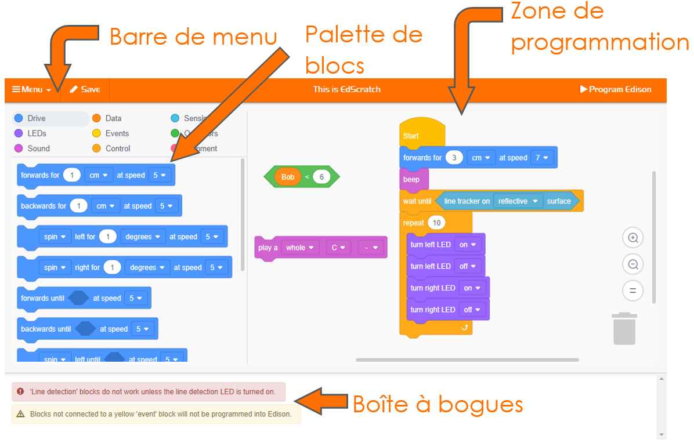

# Prise en main d'EdScratch <!-- omit in toc -->

L'une des meilleures choses à propos d'Edison est que vous pouvez créer vos propres programmes pour votre robot ! Pour écrire un programme pour Edison, nous devons utiliser un logiciel spécial.

---
**Zone à jargon**

Tous les ordinateurs comportent deux parties principales : le matériel et les logiciels.

- Le **matériel** est la partie physique d'un ordinateur (ou d'un robot).
- Le logiciel est l'ensemble des programmes et des applications qui font fonctionner le matériel, comme un ordinateur ou un robot.

---

Le logiciel que nous allons utiliser avec Edison est un **langage de programmation** pour robot.

---
**Zone à jargon**

Un __langage de programmation__ est un ensemble de règles et d'instructions utilisées pour écrire des programmes informatiques. EdScratch est un langage de programmation spécialement conçu pour la programmation des robots Edison.

---

Le langage de programmation que nous allons utiliser s'appelle EdScratch. Apprenons-en un peu plus sur le langage de programmation EdScratch.

# Tâche 1 : Consulte EdScratch
Tu peux accéder à EdScratch en ligne.

À l'aide de ton navigateur, vas à l'adresse [www.edscratchapp.com](www.edscratchapp.com)

Whenever you want to program Edison using EdScratch, you will always need to go to the EdScratch app.

Chaque fois que tu voudras programmer Edison en utilisant EdScratch, tu devras toujours te rendre sur l'application EdScratch.

Voici à quoi ressemble l'environnement EdScratch :

L'environnement de programmation d'EdScratch est composé de quatre parties principales :

- Palette de blocs
  - Tous les blocs que tu peux utiliser se trouvent dans la palette de blocs. Pour utiliser un bloc, sélectionne-le dans la palette de blocs et fais-le glisser dans la zone de programmation.
  
- Zone de programmation
  - La grande zone où tu peux relier les blocs entre eux pour créer des programmes s'appelle la zone de programmation. Fais glisser et dépose les blocs de la palette de blocs dans cette zone pour les utiliser dans ton programme.

- Barre de menu
  - Les options telles que "Enregistrer" (**Save**) et "Charger" (**Load**) sont accessibles à partir de la barre de menu. La barre de menu comporte également le bouton " Programmer Edison " (**Program Edison**).

- Boîte à bogues
  - Sous la palette de blocs et la zone de programmation se trouve la boîte à bogues. Les messages d'avertissement s'affichent dans cette boîte.

Regarde EdScratch sur ton ordinateur. Trouve chacune des quatre parties principales de l'environnement EdScratch.