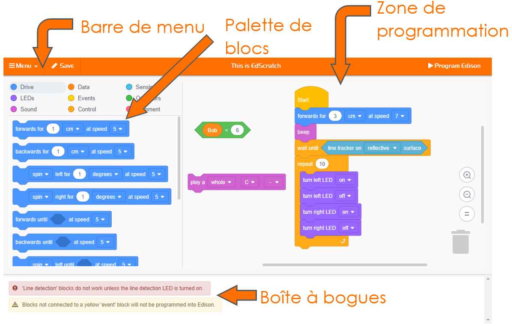
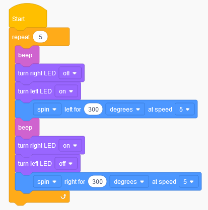

# Prise en main d'EdScratch <!-- omit in toc -->

- [Tâche 1 : Ouvre EdScratch](#tâche-1--ouvre-edscratch)
- [Tâche 2 : Charger et télécharger le programme de test](#tâche-2--charger-et-télécharger-le-programme-de-test)
  - [Charger le programme de démonstration `Test_program`](#charger-le-programme-de-démonstration-test_program)
  - [Téléverser le programme vers le robot](#téléverser-le-programme-vers-le-robot)
  - [Zone à questions](#zone-à-questions)
- [U1 - 2.1a Défi : Téléverse un autre!](#u1---21a-défi--téléverse-un-autre)
- [U1 - 2.2 Les messages d'avertissements](#u1---22-les-messages-davertissements)
  - [Essaie-le!](#essaie-le)

L'une des meilleures choses à propos d'Edison est que vous pouvez créer vos propres programmes pour votre robot ! Pour écrire un programme pour Edison, nous devons utiliser un logiciel spécial.

> **Zone à jargon**
> 
> Tous les ordinateurs comportent deux parties principales : le matériel et les logiciels.
> - Le **matériel** est la partie physique d'un ordinateur (ou d'un robot).
> - Le logiciel est l'ensemble des programmes et des applications qui font fonctionner le matériel, comme un ordinateur ou un robot.

Le logiciel que nous allons utiliser avec Edison est un **langage de programmation** pour robot.

> **Zone à jargon**
> 
> Un __langage de programmation__ est un ensemble de règles et d'instructions utilisées pour écrire des programmes informatiques. EdScratch est un langage de programmation spécialement conçu pour la programmation des robots Edison.

Le langage de programmation que nous allons utiliser s'appelle EdScratch. Apprenons-en un peu plus sur le langage de programmation EdScratch.

# Tâche 1 : Ouvre EdScratch
Tu peux accéder à EdScratch en ligne.

À l'aide de ton navigateur, vas à l'adresse https://www.edscratchapp.com/

Whenever you want to program Edison using EdScratch, you will always need to go to the EdScratch app.

Chaque fois que tu voudras programmer Edison en utilisant EdScratch, tu devras toujours te rendre sur l'application EdScratch.

Voici à quoi ressemble l'environnement EdScratch :

L'environnement de programmation d'EdScratch est composé de quatre parties principales :

- **Palette de blocs**
  - Tous les blocs que tu peux utiliser se trouvent dans la palette de blocs. Pour utiliser un bloc, sélectionne-le dans la palette de blocs et fais-le glisser dans la zone de programmation.
  
- **Zone de programmation**
  - La grande zone où tu peux relier les blocs entre eux pour créer des programmes s'appelle la zone de programmation. Fais glisser et dépose les blocs de la palette de blocs dans cette zone pour les utiliser dans ton programme.

- **Barre de menu**
  - Les options telles que "Enregistrer" (**Save**) et "Charger" (**Load**) sont accessibles à partir de la barre de menu. La barre de menu comporte également le bouton " Programmer Edison " (**Program Edison**).

- **Boîte à bogues**
  - Sous la palette de blocs et la zone de programmation se trouve la boîte à bogues. Les messages d'avertissement s'affichent dans cette boîte.

Regarde EdScratch sur ton ordinateur. Trouve chacune des quatre parties principales de l'environnement EdScratch.

# Tâche 2 : Charger et télécharger le programme de test
EdScratch a quelques programmes de démonstration déjà écrits. Essaie de charger et de télécharger le programme de démonstration appelé `Test_program`.

## Charger le programme de démonstration `Test_program`

Pour charger le programme de démonstration `Test_program`, fais les étapes suivantes :
1.	Dans EdScratch, vas dans la barre de menu et sélectionne le menu déroulant. Trouve et sélectionne l'option appelée `Load Demos`. Cela ouvrira une fenêtre pop-up avec tous les programmes de démonstration.
2.	Trouve et sélectionne le programme appelé `Test_program`. Le programme sera chargé dans la zone de programmation.

Voici ce que le ressemble `Test_program`:

Une fois que le programme est chargé dans la zone de programmation, tu peux le téléverser dans le robot Edison.

## Téléverser le programme vers le robot
Lorsque tu veux télécharger un programme d'EdScratch vers Edison, tu dois suivre les étapes suivantes : 
1.	Connectes l'Édison à ton ordinateur à l'aide du câble EdComm. 
2.	Assure-toi que le volume est monté à fond sur l'ordinateur.
3.	Aoppuye une fois sur le bouton d'enregistrement (rond) de l'Édison.
4.	Vas dans la barre de menu d'EdScratch et cliques sur le bouton `Programmer Edison`.
5.	Une fenêtre pop-up s'ouvre. Une fois que le programme est prêt, un bouton intitulé `Program Edison` apparaîtra en bas de la fenêtre pop-up.
6.	Clique sur le bouton `Program Edison` dans la fenêtre pop-up.

Tu entendras le programme se télécharger sur l'Edison. Une fois le téléchargement terminé, l'Edison émettra un bip de "réussite". **Ne débranche pas l'Édison avant d'avoir entendu le bip!**

> **Note**
> 
> L'Edison t'indique si le programme a été téléchargé correctement en émettant un bip de réussite. C'est le même son que tu entends  lorsque tu allumes Edison pour la première fois.
> 
> Il y a un autre son qu'Edison peut émettre si un programme ne se télécharge pas correctement. Nous l'appelons le son "échec". Cela signifie que quelque chose s'est mal passé lorsque le programme a essayé de se télécharger. Si Edison émet ce son, essaie de recommencer le téléchargement.

Une fois que tu as entendu le bip de réussite d'Edison, débranche le robot du câble EdComm. Appuies une fois sur le bouton play (triangle) pour lancer le programme.

## Zone à questions
- Qu'est-ce que le robot fait quand tu exécute `Test_program`? Décris ce qui se passe.

# U1 - 2.1a Défi : Téléverse un autre!
Il y a plusieurs programmes de démonstration dans EdScratch. 

Choisis un programme autre que `Test_program` dans la liste des programmes de démonstration.

Essaie de télécharger et d'exécuter le programme de démonstration de ton choix pour voir ce que fait ce programme.
1.	Quel est le nom du programme que tu as choisi?	
2.	Qu'attendais-tu du programme ? Le programme a-t-il répondu à tes attentes?
3.	Regarde le programme que tu as choisi dans EdScratch. Pense à ce que fait le robot lorsque tu exécutes le programme. Que remarques-tu? Comment les blocs du programme sont-ils liés à ce que fait le robot lorsque t'exécutes le programme dans Edison?

# U1 - 2.2 Les messages d'avertissements
Certains langages de programmation ont des caractéristiques spéciales pour faciliter l'utilisation de ce langage. Un exemple de ceci est la boîte à bogues dans EdScratch. 

Parfois, lorsque nous écrivons un programme pour Édison dans EdScratch, quelque chose ne va pas. Lorsque cela se produit, un message d'avertissement s'affiche dans la boîte à bogues.

Il existe deux types de messages d'avertissement : les messages d'avertissement jaunes et les messages d'avertissement rouges. 

> **Notes**
> 
>  Les messages jaunes sont des messages d'avertissement. C'est EdScratch qui dit "Attention! Ceci pourrait ne pas fonctionner comme tu le souhaites". Tu peux télécharger un programme même s'il y a des messages jaunes dans la boîte à bogues.
> 
>  Les messages d'avertissement rouges sont comme des messages "stop". Ces messages sont EdScratch disant "Désolé! Ce programme n'a pas de sens pour Edison". S'il y a des messages d'avertissement rouges dans la boîte à bogues, tu ne pourras pas télécharger le programme sur Edison.

Chaque fois que tu écris des programmes pour Édison, il est bon de vérifier la boîte à bogues avant d'essayer de télécharger le programme. Les messages d'avertissement peuvent t'aider à corriger ton programme!

## Essaie-le!
Dans EdScratch, trouve et charge le programme de démonstration appelé `Warning_messages_demo`. 

Une fois le programme chargé dans EdScratch, réponds aux questions suivantes. 
1.	Essaie de télécharger ce programme sur votre robot Edison. Que se passe-t-il? Est-ce que cela fonctionne? Pourquoi ou pourquoi pas? 
2. Lis le message en rouge dans la boîte de bogue. Regarde le programme. Peux-tu résoudre le problème? Décris ce que tu as fait pour corriger le message rouge.
3.	Lis le message jaune dans la boîte de bogues. Regarde le programme. Si tu télécharges le programme alors que le message jaune est présent, quels blocs ne seront pas programmés dans Edison?

