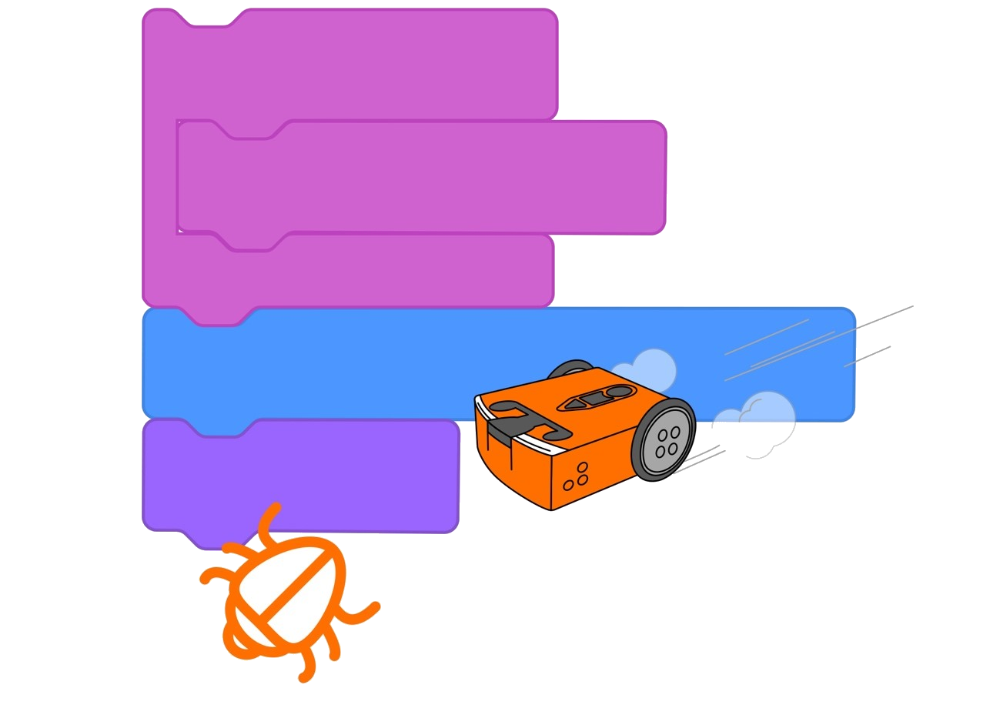
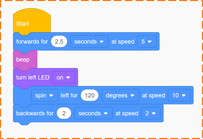
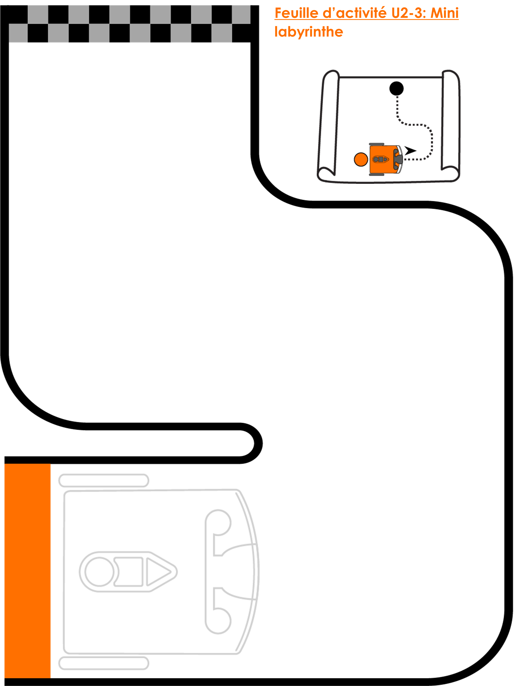

# Unité 02 : Déplace-le! <!-- omit in toc -->

# U2-1.1 Comment les ordinateurs "pensent"
Imagine un ordinateur. Maintenant, imagine une personne. Lequel des deux est le plus intelligent, selon toi?
C'est un peu une question piège. Crois-le ou non, la plupart des ordinateurs ne peuvent rien faire sans l'aide de personnes.

> **Pourquoi?**
> 
> Les ordinateurs et les personnes peuvent suivre des instructions, mais les personnes peuvent également penser par elles-mêmes. Nous pouvons apprendre et modifier ce que nous faisons sur la base de nouvelles connaissances. 
La plupart des ordinateurs, en revanche, ne peuvent pas le faire. Un robot Edison, par exemple, ne peut pas penser par lui-même. Il ne peut que suivre des instructions. D'où viennent ces instructions? D'une personne comme toi!

Les gens donnent des instructions aux ordinateurs en leur donnant des programmes informatiques.

Pour créer un bon programme informatique pour notre robot Edison, ou pour tout autre ordinateur, nous devons écrire ce programme de manière à ce que l'ordinateur puisse le comprendre. Pour ce faire, nous devons essayer de penser aux choses comme si nous étions un ordinateur.

Ce type de pensée est appelé **pensée computationnelle**.

> **Zone à jargon**
> 
> La **pensée computationnelle** consiste à penser à un problème ou à une tâche de la même manière qu'un ordinateur. Il s'agit d'une manière de traiter logiquement les problèmes, de les décomposer en petits morceaux, de trouver des modèles, puis d'utiliser ces informations pour trouver une solution étape par étape.
> 
> En d'autres termes, la pensée computationnelle est une façon de planifier, de résoudre des problèmes et d'analyser des informations de la même manière qu'un ordinateur.

Lorsque tu veux écrire un programme pour ton robot, tu dois utiliser la pensée computationnelle pour t'aider à déterminer ce qu'il faut faire. En apprenant à penser de manière à ce qu'Edison comprenne, tu seras en mesure de donner des instructions au robot pour qu'il fasse ce que tu veux.

L'une des choses les plus importantes pour donner des instructions à Edison est l'ordre dans lequel tu les donnes.

## L'importance d'y aller pas-à-pas
Les ordinateurs, y compris les robots Edison, sont très doués pour suivre les instructions que nous leur donnons sous forme de programmes informatiques. En fait, un robot Edison suivra les instructions d'un programme exactement comme elles sont écrites. C'est pourquoi l'une des parties les plus importantes de la pensée computationnelle est l'utilisation de **séquences**.

Imagine que tu veux faire un gâteau. Tu pourrais consulter une recette dans un livre de cuisine. Pour faire le gâteau, tu suis ensuite chaque étape une par une. C'est ça, la séquence!

Lorsque tu écriras un programme pour Edison, tu devras utiliser la séquence de la même manière. Tu dois dire à Edison exactement ce qu'il doit faire, dans l'ordre exact où tu veux que le robot effectue chaque étape.

# U2-1.2 : EdScratch pas-à-pas
Lorsque tu écris un programme pour ton robot Edison dans EdScratch, tu écris les instructions qui indiquent au robot ce qu'il doit faire et dans quel ordre il doit le faire. Chaque bloc EdScratch représente une action que tu demandes au robot de réaliser.

L'ordre dans lequel tu relies les blocs entre eux dans ton programme indique au robot l'ordre dans lequel il doit effectuer chaque action. Edison effectuera les actions dans l'ordre, une par une, en commençant par le bloc du haut.

C'est un peu comme le jeu "Jean dit"!

## Tâche 01 : Qu'est-ce que le robot va faire?
Regarde le programme suivant :

> **Note**
> 
> Tu remarques que le programme en anglais. En effet, dans la très grande majorité des langages de programmation sont en anglais.
> Toutefois, ne t'en fais pas! Ce sont souvent des mots simples et facile à comprendre. Ce n'est pas un Shakespeare! :)

Tous les programmes EdScratch doivent débuter avec un bloc jaune `Start`. Celui-ci permet d'indiquer au robot que le programme débute en-dessous du `Start`.

**Question :**
- Que penses-tu que le robot va faire avec ce programme?

## Tâche 02 : Code le programme
Vas sur l'application EdScratch sur ton ordinateur et code le programme de l'image précédente. Trouve chaque bloc dans la palette de blocs et fais-le glisser dans la zone de programmation.

> **Astuces**
> 
> Tu peux modifier les chiffres dans un bloc en cliquant sur le chiffre et le modifier avec le clavier.
> 
> Tu peux modifier les items dans une liste dans un bloc en cliquant sur la flèche pointant vers le bas et sélectionner l'optionque tu désires.

Assure-toi que tu mets tous les blocs dans la séquence correcte dans ton programme.

- Quand tu as terminé, télécharge le programme sur le robot, est-ce qu'il fait ce que tu pensais à la question précédente? Si non, regarde ton programme et ce qu'il y a dans l'image et essaie de corriger l'erreur.

## Tâche 03 : Change la séquence
- Change l'ordre d'au moins 3 blocs dans ton programme. N'ajoute pas d'autres blocs ou ne modifie pas les options dans les blocs.
- Télécharge le nouveau programme et observe tes modifications.
- Est-ce que celles-ci répondent à tes attentes? Si non, pourquoi?

# U2-1.3 Piloter le robot!
Un des groupes de blocs dans EdScratch est la catégorie `Drive`. Tous les blocs dans cette catégorie sont liés aux moteurs d'Edison. Une des choses que l'on peut faire avec les moteurs est de déplacer le robot comme une voiture.

C'est en programmant le robot avec du code que l'on va le piloter.

## Tâche 01 : Conduire droit devant
Pour cette tâche, tu dois faire en sorte qu'Edison conduise une voie droite. Tu dois écrire un programme pour qu'Edison puisse parcourir un tracé droit. Mesure un tracé d'environ 30 cm par terre et code le robot pour qu'il parcourt l'ensemble du tracé et s'arrête après.

**Question**
- Quel bloc as-tu utilisé?

## Tâche 02 : À travers un labyrinthe
Pour cette tâche, tu dois faire en sorte qu'Edison traverse un labyrinthe. Regarde le labyrinthe sur la fiche d'activité U2-3. Réfléchis aux différentes actions qu'Edison devra entreprendre pour traverser le labyrinthe. N'oublie pas de tenir compte de l'ordre des actions!

**Question**
- Quelles actions crois-tu qu'Edison aura de besoin pour compléter le labyrinthe?
  - Écris ton plan dans un fichier texte.

Tu vas avoir besoin de plusieurs blocs différents pour passer à travers le tracé. Tu devras aussi essayer de trouver les **paramètres d'entrée** à utiliser pour chaque bloc.

> **Zone à jargon**
> 
> Les valeurs que tu peux changer dans un bloc comme les nombres et les choix dans les listes sont appelées `paramètres d'entrée`.

Démarre Edison au début du tracé et fais en sorte qu'il arrête après la ligne d'arrivée. Assure-toi qu'il reste à l'intérieur des lignes pendant le trajet. On ne triche pas! :)

## Feuille d'activité U2-3
[Version PDF](img/activite_labyrinthe.pdf)

