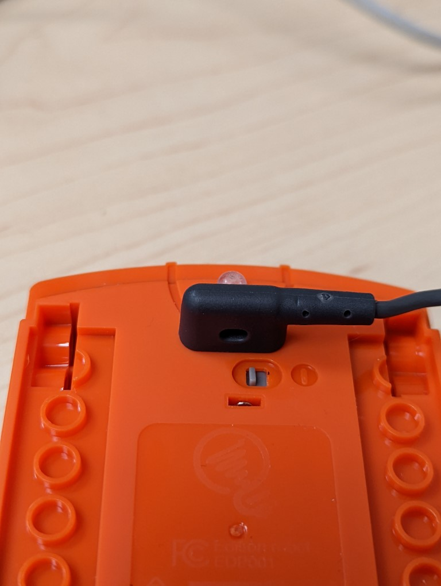

# Robot Edison : Guide de l'enseignant

Ce document sert à préparer l'enseignant qui donnera des ateliers avec le robot Edison.

# Le robot
Le robot possède trois boutons sur le dessus soit un triangle, un carré et un cercle. C'est trois boutons sont à l'image des boutons d'un radiocassette soit *Play*, *Stop* et *Record*.

Ainsi pour exécuter le programme enregistré, il suffit d'appuyer sur *Play*, pour l'arrêter *Stop* et pour enregistrer *Record*.

# Préparation du robot
1. S'assurer que les piles sont chargées.
2. Allumer le robot avec l'interrupteur qui est en-dessous.

    - **Note** : Après 5 minutes d'inutilisation, le robot se mettra en veille. On recommande de l'éteindre manuellement lorsqu'il n'est pas utilisé.

# Préparation du l'appareil de programmation

L'appareil utilisé pour la programmation doit posséder une sortie audio pour les écouteurs. Le fil de programmation se connecte dans le port audio.

L'appareil doit pouvoir émettre du son. Tester le son de l'appareil en atteignant un site tel que www.youtube.com.

Configurer l'appareil pour qu'il émette le son au niveau maximal.

# Programmation du robot

Ce robot ne nécessite aucun téléchargement. Cependant **une connexion internet est obligatoire**.

## ScratchEd
ScratchEd est l'environnement de programmation qui utilise une plateforme similaire à [Scratch](https://scratch.mit.edu/).

1. Atteindre l'application ScratchEd via l'adresse http://www.edscratchapp.com/
2. Lorsque la page est atteinte, aller dans le Menu et charger les démonstrateurs.
3. Dans la fenêtre surgissante, il y aura quelques projets de démonstration.
4. Choisir un projet simple tel que `Test_program` pour tester le fonctionnement de la programmation.

   
5. Brancher le câble de programmation sous le robot.

6. Cliquer sur le bouton `Program Edison`
7. Sur le robot, appuyer sur le bouton rond (*record*) pour le mettre en mode programmation.
8. Dans le navigateur cliquer sur le bouton `Program Edison`
   - On devrait entendre un son typique des modems des années '90
   - Lorsque la programmation est terminé, on entend un *beep*
9. Tester le code

## PyEd
PyEd est l'environnement de programmation qui utilise Python.

