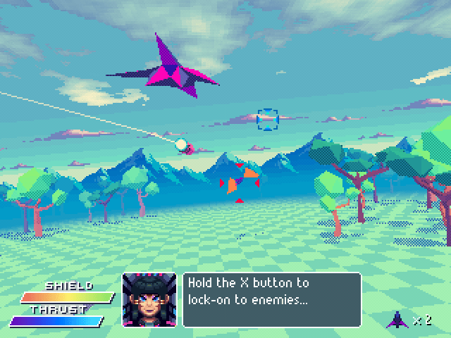
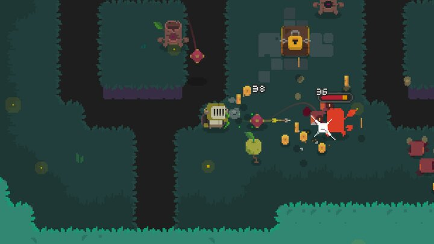
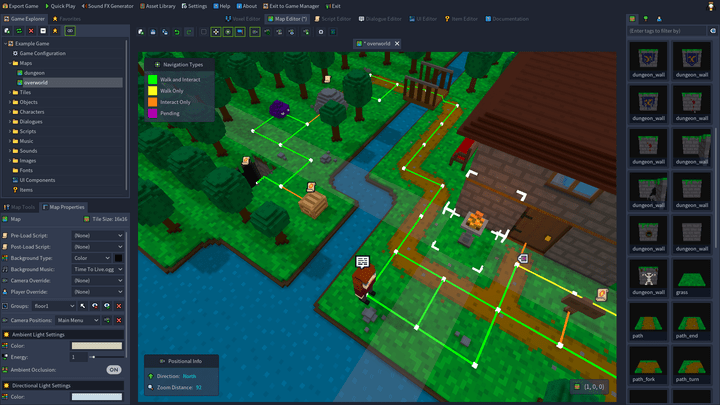

# Introduction à Godot <!-- omit in toc -->

# Qu'est-ce que Godot?
Godot est un moteur de jeu open source et gratuit qui te permet de créer des jeux 2D et 3D. Ce qui est génial avec Godot, c'est qu'il est conçu pour être aussi intuitif que possible : cela signifie que même si tu n'as jamais touché à un moteur de jeu auparavant, tu pourras rapidement apprendre à l'utiliser. Godot est équipé de tout ce dont tu as besoin pour commencer : un système de graphiques pour dessiner tes mondes, un langage de programmation pour donner vie à tes jeux, et plein d'autres outils pour ajouter des sons, des animations, et bien plus encore.

# Qu'est-ce qu'un moteur de jeu?
Un moteur de jeu, c'est un peu comme la boîte à outils d'un magicien. Il contient tout ce dont tu as besoin pour créer un jeu vidéo, de la conception des niveaux à l'animation des personnages. Un moteur de jeu te fournit les bases nécessaires pour construire des mondes, définir comment les choses bougent et interagissent, et créer des règles qui déterminent ce qui se passe dans ton jeu. En gros, sans moteur de jeu, tu devrais tout programmer à partir de zéro, ce qui est beaucoup plus compliqué et prend énormément de temps.

Voici quelques exemples de jeux créés avec Godot.

Il est aussi possible de créer des jeux 3D avec Godot, mais nous allons nous concentrer sur les jeux 2D pour le moment.

# Comment ça marche et à quoi ça ressemble?
Quand tu ouvres Godot pour la première fois, tu découvriras une interface utilisateur divisée en plusieurs parties : l'éditeur de scène, où tu construis ton jeu en ajoutant des objets et en définissant leur comportement; l'éditeur de script, où tu écris le code qui dicte la logique de ton jeu; et la barre d'outils, qui te donne accès à toutes sortes de fonctionnalités utiles. Avec Godot, tu peux glisser et déposer des éléments dans ton jeu, ajuster leurs propriétés facilement et voir les résultats en temps réel. C'est comme avoir un laboratoire de jeu vidéo à ta disposition!

# Langages de programmation
Godot utilise son propre langage de programmation appelé GDScript, qui est spécialement conçu pour la création de jeux. GDScript est assez simple à apprendre, surtout si tu as déjà une petite idée de ce qu'est la programmation. Il ressemble beaucoup à Python, un langage connu pour sa facilité de lecture et d'écriture. Ne t'inquiète pas si tu es complètement nouveau dans ce domaine : on va explorer ensemble les bases de GDScript et comment l'utiliser pour animer tes idées de jeux.

# Qu'est-ce que j'ai besoin de savoir pour commencer?
Pour commencer avec Godot, tu n'as pas besoin de beaucoup : un ordinateur assez récent pour faire tourner le logiciel et une bonne dose de créativité. Il n'est pas nécessaire d'être un expert en programmation ou en design graphique dès le départ. Tout ce que tu dois savoir, tu l'apprendras en faisant, étape par étape. La communauté Godot est également là pour t'aider : il y a des tonnes de tutoriels, de forums, et de ressources en ligne pour répondre à tes questions. Alors, prêt à plonger dans la création de jeux vidéo avec Godot? C'est parti!
