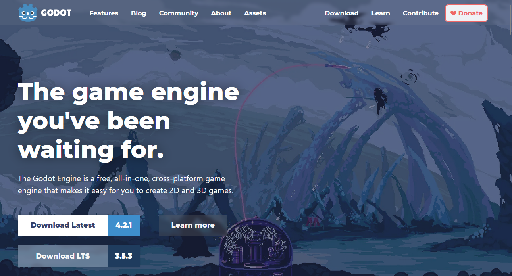
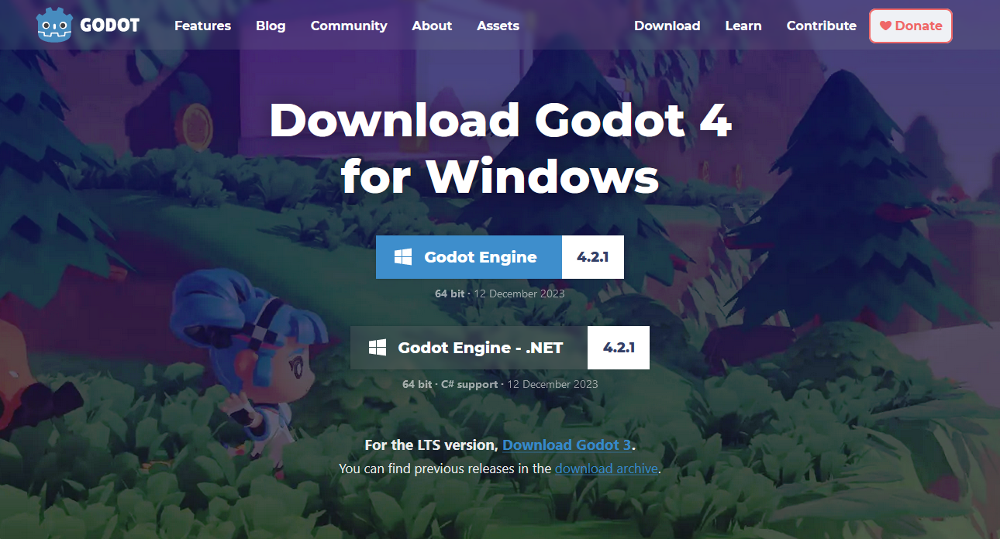
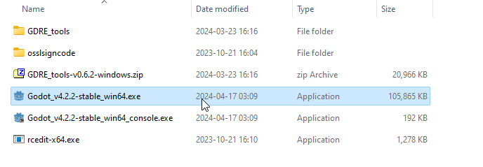
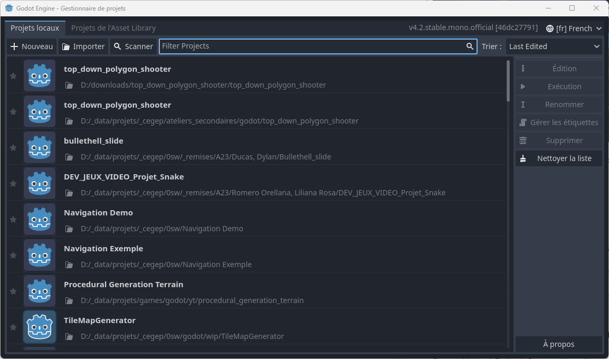

# Installation de Godot <!-- omit in toc -->

# Objectifs <!-- omit in toc -->
- Télécharger Godot
- Exécuter Godot pour la première fois

# Table des matières <!-- omit in toc -->
- [Télécharger Godot](#télécharger-godot)
  - [Méthode 1 : Télécharger Godot via Steam](#méthode-1--télécharger-godot-via-steam)
  - [Méthode 2 : Télécharger Godot depuis le site officiel](#méthode-2--télécharger-godot-depuis-le-site-officiel)
    - [Extraire le contenu du fichier zip](#extraire-le-contenu-du-fichier-zip)
- [Première exécution de Godot](#première-exécution-de-godot)
- [Conclusion](#conclusion)

# Télécharger Godot
La première chose à faire pour commencer à utiliser Godot est de télécharger le logiciel. Il y a deux façons que je montre pour télécharger Godot. La première méthode est d'utiliser Steam, et la deuxième méthode est de télécharger directement le logiciel depuis le site officiel de Godot.

## Méthode 1 : Télécharger Godot via Steam
Si tu connais et sais comment utiliser Steam, il te suffit de rechercher "Godot" dans la barre de recherche de Steam et de télécharger le logiciel. Si tu ne connais pas Steam, tu peux suivre la 2e méthode.

## Méthode 2 : Télécharger Godot depuis le site officiel
Tu peux te rendre sur le site officiel de Godot à l'adresse suivante : [https://godotengine.org/download](https://godotengine.org/download). Tu y trouveras les versions les plus récentes de Godot pour Windows, macOS et Linux.

Dans la page principale, tu n'as qu'à cliquer sur le bouton de "Download Latest" qui t'emmènera vers la page de téléchargement. Tu devrais y trouver 2 options de téléchargement : cliques sur le bouton "Godot Engine" pour télécharger le logiciel.

Cette action va télécharger un ***fichier compressé*** contenant le logiciel. Sur les appareils Windows, le fichier devrait être dans le dossier "Téléchargements".

> **Note** : Un ***fichier compressé***, communément appelé *fichier zip*, est un fichier qui contient d'autres fichiers. Il est compressé pour réduire sa taille et faciliter le téléchargement. Généralement, tu dois extraire le contenu du fichier zip avant de pouvoir utiliser les fichiers qu'il contient.

Si tu sais comment extraire un fichier zip, tu peux passer à la section suivante. Sinon, continue à lire pour savoir comment extraire le contenu du fichier zip.

### Extraire le contenu du fichier zip
Suis les étapes suivantes pour extraire le contenu du fichier zip :

1. Pour extraire le contenu du fichier zip, tu peux faire un clic droit sur le fichier et sélectionner "Extraire tout...".
2. Dans la fenêtre qui s'ouvre, tu peux choisir l'emplacement où tu veux extraire le contenu du fichier zip. Tu peux laisser l'emplacement par défaut ou choisir un autre dossier.
   - J'aime bien avec le programme disponible rapidement, alors je l'extrait sur le bureau. Tu peux choisir un autre endroit si tu préfères.
3. Une fois que tu as extrait le contenu du fichier zip, tu devrais voir un dossier avec le nom `Godot_v4.xyz` (ou une version similaire). Ouvre ce dossier pour voir le contenu.

---

# Première exécution de Godot
Si tu as téléchargé Godot via Steam, tu n'as qu'à ouvrir Steam et lancer Godot. Si tu as téléchargé Godot depuis le site officiel, tu devras ouvrir le logiciel à partir du fichier exécutable que tu as extrait du fichier zip. Le nom du fichier exécutable devrait ressembler à ceci `Godot_v4.xyz` (ou une version similaire).

Pour l'ouvrir, il suffit de double-cliquer sur le fichier exécutable.

Si c'est la première fois que tu ouvres Godot, il y aura un message qui indiquera si tu désires ouvrir la bibliothèque de projets. Tu peux cliquer sur `Annuler`.

Ensuite, tu devrais voir une fenêtre qui ressemble à ceci :

Il s'agit de l'interface de démarrage de Godot. Tu peux créer un nouveau projet, ouvrir un projet existant, ou consulter la documentation de Godot.

Dans la capture d'écran, il y déjà plusieurs projets qui sont listés. Tu n'auras pas autant de projets que moi, car j'ai déjà utilisé Godot pour créer des jeux. J'espère que tu en auras autant, sinon plus, un jour!

---

# Conclusion
Dans cette section, tu as appris à télécharger Godot et à l'exécuter pour la première fois. Dans la prochaine section, tu apprendras à créer un nouveau projet dans Godot.