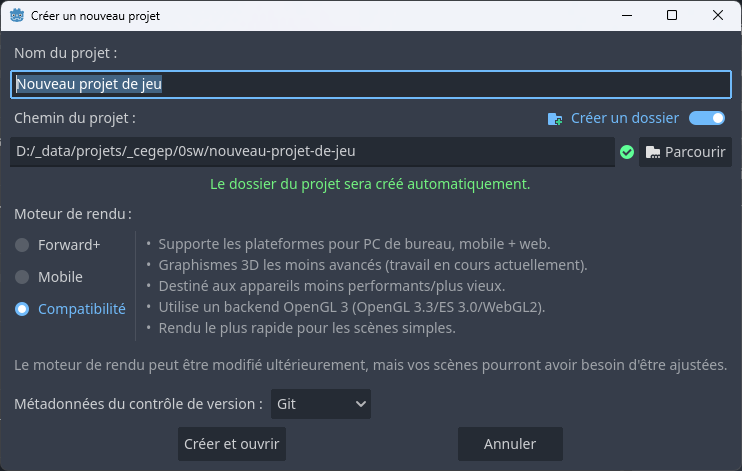
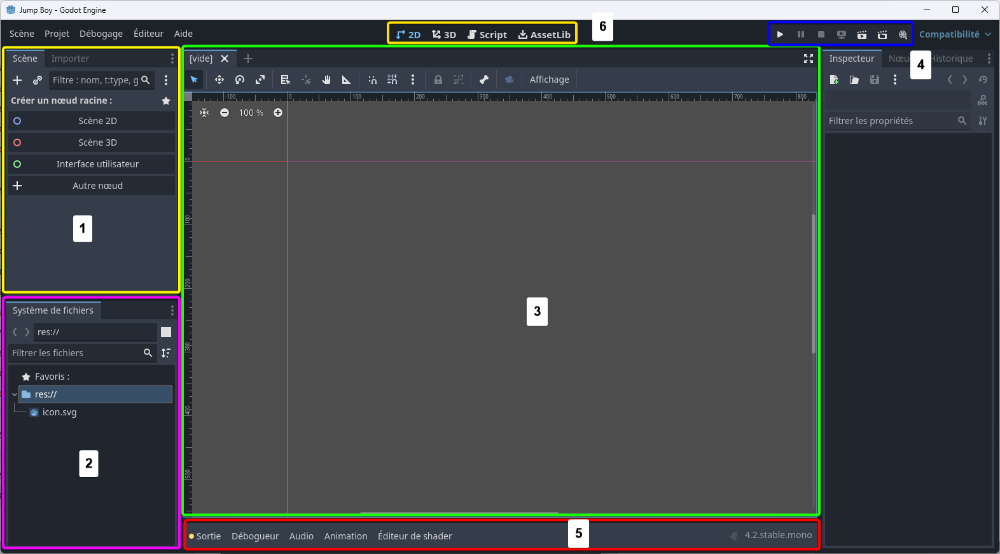

# Créer un premier projet avec Godot <!-- omit in toc -->

# Objectifs <!-- omit in toc -->
- Créer un nouveau projet avec Godot
- Explorer les bases de l'interface de Godot

# Table des matières <!-- omit in toc -->
- [Créer un nouveau projet](#créer-un-nouveau-projet)
- [Interface de création d'un nouveau projet](#interface-de-création-dun-nouveau-projet)
  - [Exercice](#exercice)
- [L'environnement de travail de Godot](#lenvironnement-de-travail-de-godot)
  - [Volet Scène](#volet-scène)
    - [Qu'est-ce qu'une scène?](#quest-ce-quune-scène)
  - [Système de fichiers](#système-de-fichiers)
  - [Zone de travail](#zone-de-travail)

# Créer un nouveau projet
Pour créer un nouveau projet, il faudra tout d'abord exécuter Godot. Si tu ne sais pas comment exécuter Godot, tu peux te référer à la section précédente.

Dans le cadre de cet exercice, je te propose de créer un nouveau jeu de type "2D". Pour ce faire, tu peux cliquer sur le bouton "**+ Nouveau**" en haut à gauche de la fenêtre.

Tu devrais voir une fenêtre qui ressemble à ceci :

# Interface de création d'un nouveau projet
Avant de créer le projet, nous allons explorer les différentes options qui s'offrent à nous ainsi que l'ordre dans laquelle il faudra faire la configuration.

1. **Nom du projet** : C'est le nom que tu souhaites donner à ton projet. Tu peux le modifier à ta guise.
   - **Note** : Si le chemin du projet te convient, tu peux cliquer sur le bouton "**Créer un dossier**" pour créer un dossier avec le nom du projet. 
2. **Chemin du projet** : C'est l'endroit où tu souhaites enregistrer ton projet. Tu peux cliquer sur le bouton "**Parcourir**" pour choisir un dossier.
   - **Note** : Je suggère de mettre tous tes projets dans un dossier spécifique pour éviter de les mélanger avec d'autres fichiers.
   - **Note** : Si tu vois un message jaune, c'est que le chemin n'existe pas. Tu peux cliquer sur le bouton "**Créer un dossier**" pour créer le dossier.
3. **Moteur de rendu** : C'est le moteur de rendu que tu souhaites utiliser pour ton projet. Pour le moment, nous allons laisser la valeur par défaut.
    - Forward+ : C'est le moteur de rendu le plus avancé, mais il ne fonctionne qu'avec les PC.
    - Mobile : Comme son nom l'indique, c'est le moteur de rendu qui fonctionne avec les appareils mobiles, mais aussi avec les PC.
    - Compatibilité : En plus de fonctionner avec les PC et les mobiles, ce moteur de rendu fonctionne aussi avec les navigateurs web.
4. **Créer et ouvrer** : C'est le bouton qui te permettra de créer le projet et de l'ouvrir dans Godot.

## Exercice
1. Donne le nom "Aventurier" à ton projet.
   - Tu peux aussi choisir un autre nom si tu préfères.
2. Choisis un emplacement pour ton projet.
3. Si l'avertissement jaune apparaît, clique sur le bouton "Créer un dossier".
4. Clique sur le bouton "Créer et ouvrir".
5. 

---

# L'environnement de travail de Godot
Lorsque tu auras cliqué sur le bouton "Créer et ouvrir", tu devrais voir une fenêtre qui ressemble à ceci :

Assez impressionnant, non? Ne t'inquiète pas, je vais t'expliquer les bases de l'interface de Godot.

Étant un jeu en 2D, nous allons nous concentrer sur l'interface de Godot pour les jeux en 2D.
- **Clique sur le bouton "2D"** en haut au centre de la fenêtre pour passer en mode 2D.

Dans la capture d'écran suivante, j'ai mis en évidence les éléments les plus importants de l'interface de Godot pour les jeux en 2D.

1. **Volet Scène** : C'est le volet où tu pourras voir les éléments de la scène active.
2. **Système de fichiers** : C'est l'endroit où tu pourras voir les fichiers de ton projet.
3. **Zone de travail** : C'est la zone où tu pourras voir et modifier les éléments de la scène active. C'est ton terrain de jeu visuel.
4. **Boutons d'exécution** : C'est l'endroit où tu devras cliquer pour exécuter ton jeu et ta scène.
5. **Volet de débogage** : C'est le volet où tu pourras voir les messages d'erreur et débogage de ton jeu.

> **Euh... j'ai rien compris!**  
> Il y a de forte chance que tu ne comprennes pas tout de suite. C'est normal. Nous allons explorer chaque élément de l'interface de Godot dans les prochains exercices.

## Volet Scène
Le volet Scène est l'endroit où tu pourras voir les éléments de la scène active, c'est-à-dire la scène que tu es en train de modifier dans la zone de travail.

Voici ce à quoi pourrait ressembler le contenu du volet Scène avece un jeu déjà en cours de développement.

### Qu'est-ce qu'une scène?
Une scène est un élément de base dans Godot. C'est un conteneur pour les éléments de ton jeu. Par exemple, un joueur, un ennemi, un arbre, etc. sont des éléments qui peuvent être placés dans une scène.

Si on prend l'exemple d'un jeu de plateforme, une scène pourrait contenir le joueur, les ennemis, les plateformes, les pièges, les bonus, etc.

Nous reviendrons en détail sur les scènes dans les sections suivantes.

## Système de fichiers
Le système de fichiers est l'endroit où tu pourras voir les fichiers de ton projet. C'est l'endroit où tu pourras ajouter, supprimer, renommer, déplacer, etc. les fichiers de ton projet.

Les fichiers peuvent être des scènes, des scripts, des images, des sons, des vidéos, etc.

## Zone de travail
La zone de travail est l'endroit où tu pourras voir et modifier les éléments de la scène active. C'est ton terrain de jeu visuel.

Tu y glisseras et déposeras les éléments de ton jeu pour les modifier.