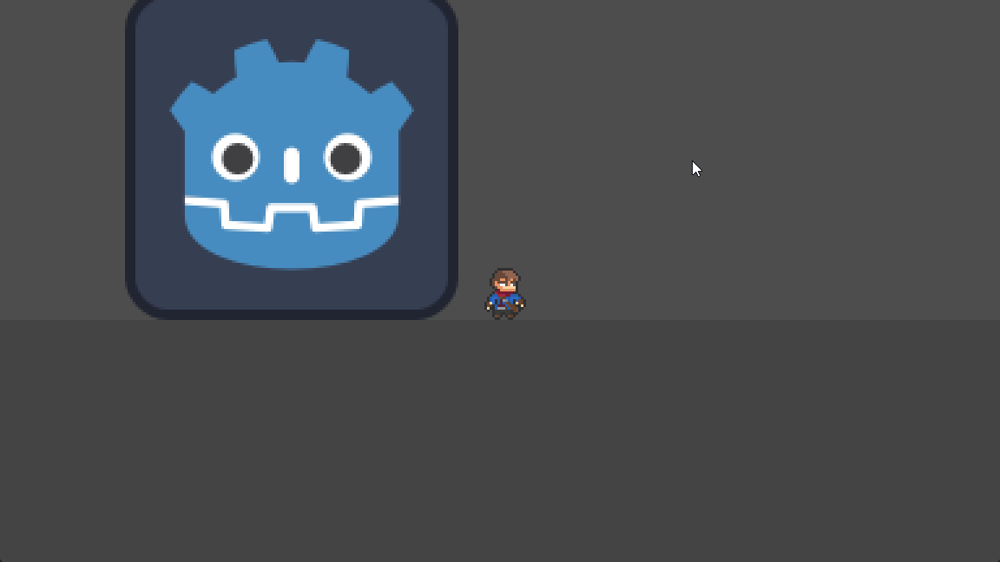
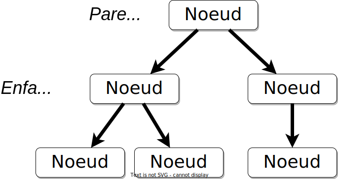
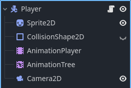

# Le personnage principal <!-- omit in toc -->

Dans les sections précédentes, nous avons vu comment installer, démarrer et créer un projet dans Godot. Dans cette section, nous allons voir comment créer notre personnage principal.

# Table des matières <!-- omit in toc -->
- [Objectifs](#objectifs)
- [Comprendre le concept de noeud dans Godot](#comprendre-le-concept-de-noeud-dans-godot)
  - [Qu'est-ce qu'un noeud ?](#quest-ce-quun-noeud-)
  - [Pourquoi les noeuds sont-ils importants ?](#pourquoi-les-noeuds-sont-ils-importants-)
  - [Comment travailler avec les noeuds ?](#comment-travailler-avec-les-noeuds-)

# Objectifs
- Comprendre le concept de noeud dans Godot
- Ajouter des noeuds
- Créer une scène pour le personnage principal
- Créer un personnage principal
- Animer le personnage principal
- Déplacer le personnage principal

---

# Comprendre le concept de noeud dans Godot
Avant de plonger dans la création de votre propre personnage de jeu, il est essentiel de comprendre un concept fondamental de Godot : les noeuds (*nodes*). Imaginez que chaque jeu que vous créez avec Godot soit comme un grand arbre composé de petites pièces appelées "noeuds". Chaque pièce, ou noeud, a une fonction spécifique et travaille avec les autres pour faire fonctionner le jeu.

## Qu'est-ce qu'un noeud ?

Un noeud dans Godot peut être vu comme un bloc de construction. Tout comme les blocs de LEGO, chaque noeud a sa propre forme et fonction, et vous pouvez les assembler de différentes manières pour créer des structures complexes. Dans Godot, un noeud pourrait être un personnage, une caméra, un élément de décor, ou même un script qui contrôle certaines règles du jeu.

Voici un exemple de la hiérarchie des noeuds pour un joueur typique dans Godot :

TODO : Ajouter le diagramme en arbre

## Pourquoi les noeuds sont-ils importants ?

Les noeuds sont au cœur de chaque projet dans Godot. Ils vous permettent de :

- **Organiser votre jeu** : Chaque noeud peut contenir d'autres noeuds. Par exemple, un noeud "Personnage" peut contenir des noeuds pour ses animations, ses sons, et ses comportements. Cette organisation hiérarchique aide à garder les éléments de votre jeu bien rangés et faciles à gérer.
  
- **Spécialiser les fonctionnalités** : Godot offre différents types de noeuds, chacun étant spécialisé dans une tâche spécifique. Il y a des noeuds pour afficher des images, jouer des sons, collecter des entrées de l'utilisateur, et bien plus. En utilisant le bon type de noeud pour la bonne tâche, vous pouvez construire votre jeu de manière efficace et intuitive.

- **Réutiliser des éléments** : Une fois que vous avez configuré un noeud pour une tâche spécifique, comme un ennemi qui patrouille ou une porte qui s'ouvre quand le joueur s'approche, vous pouvez réutiliser ce noeud dans d'autres parties de votre jeu. Cela vous permet de créer des jeux plus complexes sans avoir à tout refaire à chaque fois.

## Comment travailler avec les noeuds ?

Travailler avec des noeuds dans Godot est comme jouer à un jeu de construction virtuel. Vous pouvez ajouter des noeuds à votre projet, les configurer pour qu'ils fassent ce que vous voulez, et les connecter les uns aux autres pour qu'ils interagissent. Voici comment vous pourriez commencer :

1. **Ajouter un noeud** : Dans l'interface de Godot, vous pouvez choisir parmi une liste de noeuds et les ajouter à votre scène.
2. **Configurer le noeud** : Chaque noeud a des propriétés que vous pouvez modifier. Par exemple, pour un noeud de type "Sprite", vous pouvez charger une image que vous voulez afficher.
3. **Relier les noeuds** : Vous pouvez faire en sorte que les noeuds réagissent aux actions dans le jeu en les connectant. Par exemple, vous pourriez connecter un noeud de type "Area" à un script qui déclenche une alarme lorsque le joueur entre dans une zone spécifique.

// TODO : Continuer la section

