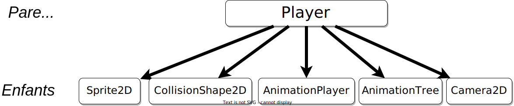
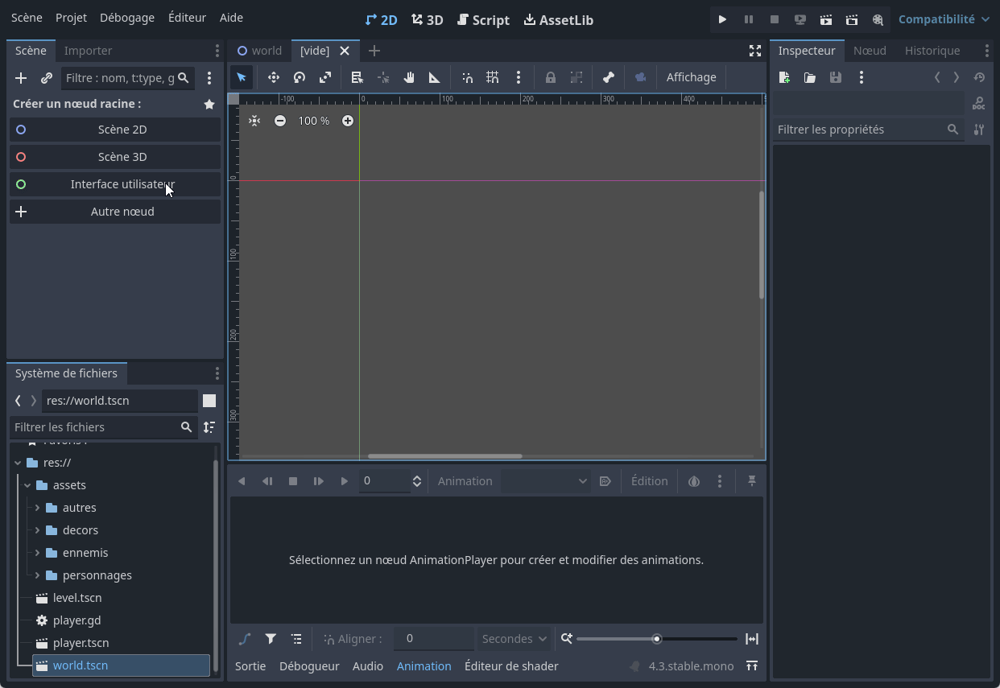
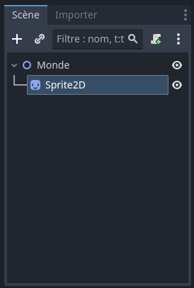
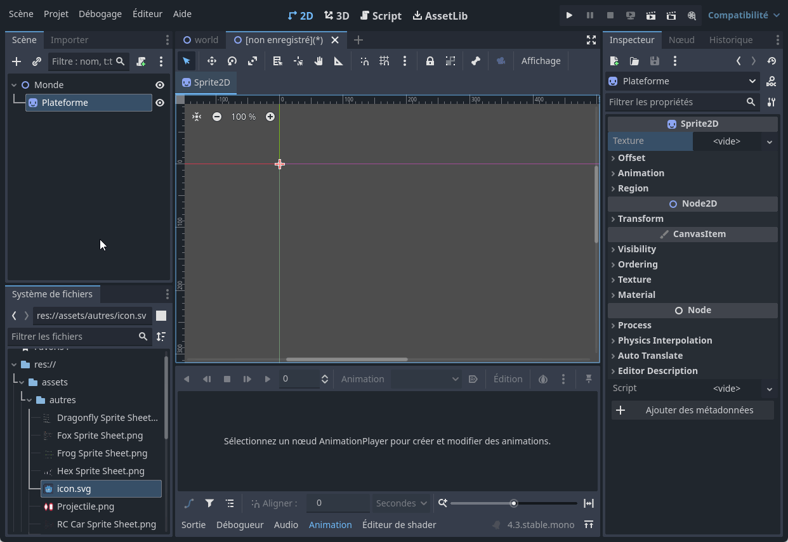
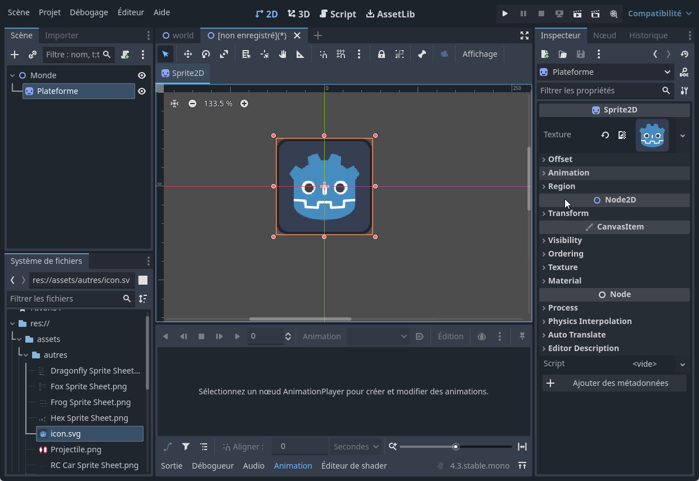
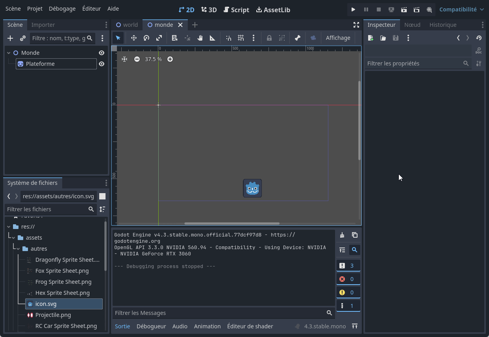
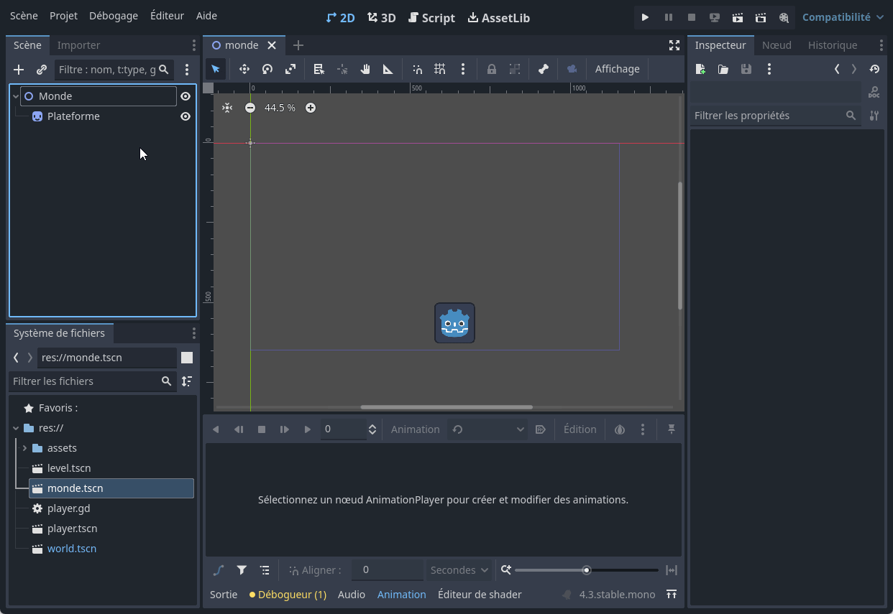

# Le personnage principal <!-- omit in toc -->

Dans les sections précédentes, nous avons vu comment installer, démarrer et créer un projet dans Godot. Dans cette section, nous allons voir comment créer notre personnage principal.

# Table des matières <!-- omit in toc -->
- [Objectifs](#objectifs)
- [Comprendre le concept de nœud dans Godot](#comprendre-le-concept-de-nœud-dans-godot)
  - [Qu'est-ce qu'un nœud ?](#quest-ce-quun-nœud-)
  - [Pourquoi les nœuds sont-ils importants ?](#pourquoi-les-nœuds-sont-ils-importants-)
  - [Comment travailler avec les nœuds ?](#comment-travailler-avec-les-nœuds-)
- [Ajouter des nœuds](#ajouter-des-nœuds)
  - [Première image](#première-image)
  - [Le personnage principal](#le-personnage-principal)

# Objectifs
- Comprendre le concept de nœud dans Godot
- Ajouter des nœuds
- Créer une scène pour le personnage principal
- Créer un personnage principal
- Animer le personnage principal
- Déplacer le personnage principal

---

# Comprendre le concept de nœud dans Godot
Avant de plonger dans la création de votre propre personnage de jeu, il est essentiel de comprendre un concept fondamental de Godot : les nœuds (*nodes*). Imaginez que chaque jeu que vous créez avec Godot soit comme un grand arbre composé de petites pièces appelées "nœuds". Chaque pièce, ou nœud, a une fonction spécifique et travaille avec les autres pour faire fonctionner le jeu.

## Qu'est-ce qu'un nœud ?

Un nœud dans Godot peut être vu comme un bloc de construction. Tout comme les blocs de LEGO, chaque nœud a sa propre forme et fonction, et vous pouvez les assembler de différentes manières pour créer des structures complexes. Dans Godot, un nœud pourrait être un personnage, une caméra, un élément de décor, ou même un script qui contrôle certaines règles du jeu.

Voici un exemple de la hiérarchie des nœuds pour un joueur typique dans Godot :

Voici sa représentation sous forme d'arbre :

## Pourquoi les nœuds sont-ils importants ?

Les nœuds sont au cœur de chaque projet dans Godot. Ils vous permettent de :

- **Organiser votre jeu** : Chaque nœud peut contenir d'autres nœuds. Par exemple, un nœud `Personnage` peut contenir des nœuds pour ses animations, ses sons, et ses comportements. Cette organisation hiérarchique aide à garder les éléments de votre jeu bien rangés et faciles à gérer.
  
- **Spécialiser les fonctionnalités** : Godot offre différents types de nœuds, chacun étant spécialisé dans une tâche spécifique. Il y a des nœuds pour afficher des images, jouer des sons, collecter des entrées de l'utilisateur, et bien plus. En utilisant le bon type de nœud pour la bonne tâche, vous pouvez construire votre jeu de manière efficace et intuitive.

- **Réutiliser des éléments** : Une fois que vous avez configuré un nœud pour une tâche spécifique, comme un ennemi qui patrouille ou une porte qui s'ouvre quand le joueur s'approche, vous pouvez réutiliser ce nœud dans d'autres parties de votre jeu. Cela vous permet de créer des jeux plus complexes sans avoir à tout refaire à chaque fois.

## Comment travailler avec les nœuds ?

Travailler avec des nœuds dans Godot est comme jouer à un jeu de construction virtuel. Vous pouvez ajouter des nœuds à votre projet, les configurer pour qu'ils fassent ce que vous voulez, et les connecter les uns aux autres pour qu'ils interagissent. Voici comment vous pourriez commencer :

1. **Ajouter un nœud** : Dans l'interface de Godot, vous pouvez choisir parmi une liste de nœuds et les ajouter à votre scène.
2. **Configurer le nœud** : Chaque nœud a des propriétés que vous pouvez modifier. Par exemple, pour un nœud de type "Sprite", vous pouvez charger une image que vous voulez afficher.
3. **Relier les nœuds** : Vous pouvez faire en sorte que les nœuds réagissent aux actions dans le jeu en les connectant. Par exemple, vous pourriez connecter un nœud de type "Area" à un script qui déclenche une alarme lorsque le joueur entre dans une zone spécifique.

---

# Ajouter des nœuds
## Première image
La première chose que l'on va faire c'est de créer le monde dans lequel le personnage évoluera. Pour cela, nous allons ajouter un nœud 2D à notre scène. Voici comment faire :

1. Si le projet n'est pas déjà ouvert, ouvrez-le dans Godot. (Voir la section précédente pour plus de détails)
2. Dans le volet Scène (à gauche), cliquez sur le bouton `Scène 2D` pour ajouter un nœud 2D à la scène. Ce sera la racine de notre scène.
3. Renommez le nœud 2D en `Monde` en double-cliquant sur son nom.

Pour l'instant, notre monde est vide. Nous n'avons créé qu'un nœud vide, mais celui-ci servira de conteneur pour tous les autres éléments de notre jeu.

4. Sélectionnez le nœud `Monde` dans le volet Scène.
5. Cliquez sur le bouton `+` pour ajouter un nœud enfant à `Monde`. Une fenêtre s'ouvrira avec une liste de nœuds que vous pouvez ajouter.
6. Cherchez et sélectionnez le nœud `Sprite2D` dans la liste, puis cliquez sur le bouton `Créer`.

Un `Sprite2D` est un nœud qui affiche une image à l'écran. Nous allons l'utiliser pour afficher une plateforme sur laquelle notre personnage pourra marcher.

7. Renommez le nœud `Sprite2D` en `Plateforme` en double-cliquant sur son nom.
8. Repérez le champ `Texture` dans l'inspecteur (à droite). Il devrait y être inscrit `<vide>`.
9. Dans le système de fichiers en bas à gauche, vous devriez avoir un fichier appelé `icon.svg`. Faites glisser ce fichier sur le champ `Texture` du nœud `Plateforme`.

10. Dézoomez dans la vue de la scène jusqu'à ce que vous puissiez voir un rectangle bleu-violet. Il s'agit de la dimension par défaut de la fenêtre de jeu.
11. Déplacez l'image de la plateforme dans la partie inférieure de la fenêtre de jeu.

12. Nous allons exécutez le jeu pour voir ce que cela donne. Cliquez sur le bouton `Exécuter la scène actuelle` en haut à droite.
    - Le bouton est représenté par un clap de cinéma.
13. Si c'est la première fois que vous exécutez le jeu, vous devrez enregistrer la scène. Pour l'instant, enregistrez-la sous le nom `Monde.tscn`.
14. Une fenêtre de jeu s'ouvrira, et vous devriez voir la plateforme que vous avez ajoutée.
15. Appuyez sur le `X` en haut à droite de la fenêtre pour quitter le jeu.

---

## Le personnage principal
Maintenant que nous avons créé notre monde, il est temps d'ajouter notre personnage principal. Nous allons créer un nœud `Personnage` qui contiendra le sprite de notre personnage et les animations associées.

1. Sélectionnez le nœud `Monde` dans le volet Scène.
2. Cliquez sur le bouton `+` pour ajouter un nœud enfant à `Monde`.
3. Cherchez et sélectionnez le nœud `CharacterBody2D`
4. Cliquez sur le bouton `Créer`.
5. Renommez le nœud `CharacterBody2D` en `Personnage` en double-cliquant sur son nom.

Cela ajoutera un nœud `CharacterBody2D` à la scène. Ce nœud contiendra la physique et les animations de notre personnage.
Remarquez le petit point d'exclamation à côté du nœud `CharacterBody2D`. Cela signifie que le nœud a des erreurs. C'est parce que nous n'avons pas encore configuré les éléments nécessaires pour qu'il fonctionne correctement.

