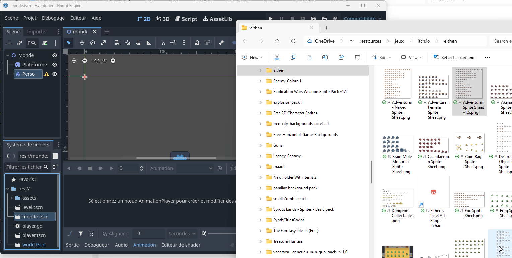
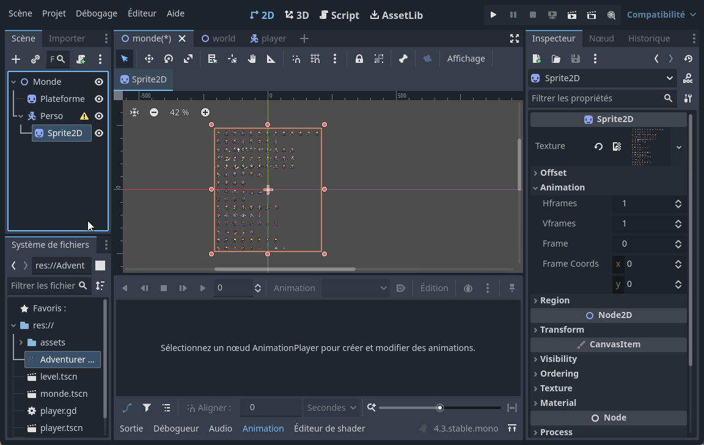
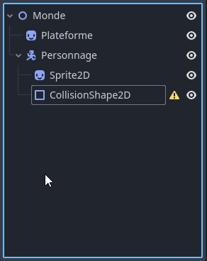
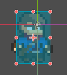
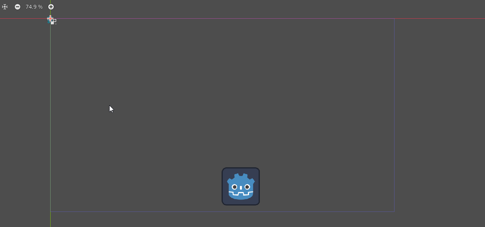
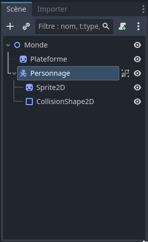
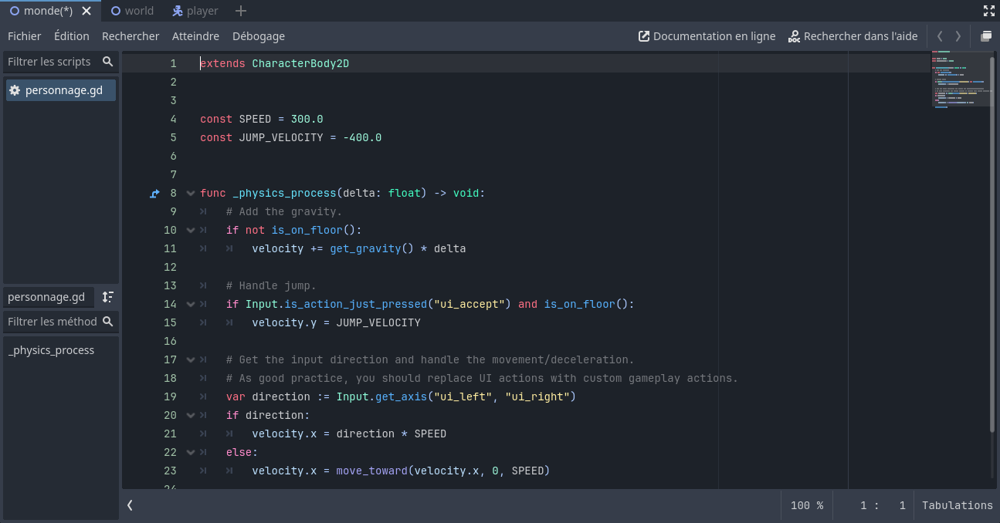
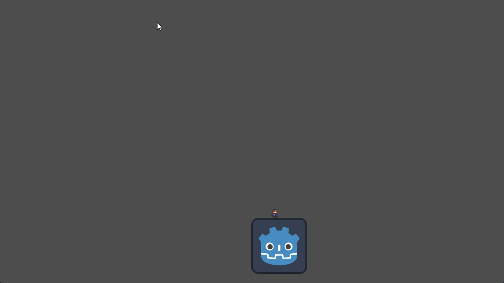
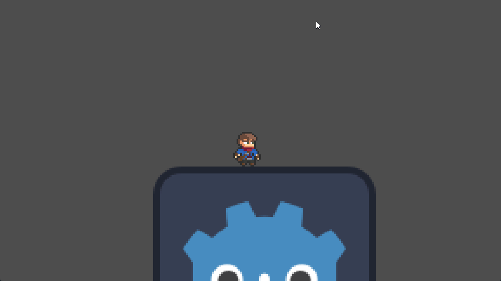

# Le personnage principal <!-- omit in toc -->

Dans les sections précédentes, nous avons vu comment installer, démarrer et créer un projet dans Godot. Dans cette section, nous allons voir comment créer notre personnage principal.

# Table des matières <!-- omit in toc -->
- [Objectifs](#objectifs)
- [Comprendre le concept de nœud dans Godot](#comprendre-le-concept-de-nœud-dans-godot)
  - [Qu'est-ce qu'un nœud ?](#quest-ce-quun-nœud-)
  - [Pourquoi les nœuds sont-ils importants ?](#pourquoi-les-nœuds-sont-ils-importants-)
  - [Comment travailler avec les nœuds ?](#comment-travailler-avec-les-nœuds-)
- [Ajouter des nœuds](#ajouter-des-nœuds)
  - [Première image](#première-image)
  - [Le personnage principal](#le-personnage-principal)
    - [L'image du personnage](#limage-du-personnage)
    - [Ajouter le code de base](#ajouter-le-code-de-base)
    - [Ajouter la physique à la plateforme](#ajouter-la-physique-à-la-plateforme)
    - [Ajouter la caméra](#ajouter-la-caméra)
- [Conclusion](#conclusion)
- [Références](#références)

# Objectifs
- Comprendre le concept de nœud dans Godot
- Ajouter des nœuds
- Créer un personnage principal
- Déplacer le personnage principal

---

# Comprendre le concept de nœud dans Godot
Avant de plonger dans la création de votre propre personnage de jeu, il est essentiel de comprendre un concept fondamental de Godot : les nœuds (*nodes*). Imaginez que chaque jeu que vous créez avec Godot soit comme un grand arbre composé de petites pièces appelées "nœuds". Chaque pièce, ou nœud, a une fonction spécifique et travaille avec les autres pour faire fonctionner le jeu.

## Qu'est-ce qu'un nœud ?

Un nœud dans Godot peut être vu comme un bloc de construction. Tout comme les blocs de LEGO, chaque nœud a sa propre forme et fonction, et vous pouvez les assembler de différentes manières pour créer des structures complexes. Dans Godot, un nœud pourrait être un personnage, une caméra, un élément de décor, ou même un script qui contrôle certaines règles du jeu.

Voici un exemple de la hiérarchie des nœuds pour un joueur typique dans Godot :

Voici sa représentation sous forme d'arbre :

## Pourquoi les nœuds sont-ils importants ?

Les nœuds sont au cœur de chaque projet dans Godot. Ils vous permettent de :

- **Organiser votre jeu** : Chaque nœud peut contenir d'autres nœuds. Par exemple, un nœud `Personnage` peut contenir des nœuds pour ses animations, ses sons, et ses comportements. Cette organisation hiérarchique aide à garder les éléments de votre jeu bien rangés et faciles à gérer.
  
- **Spécialiser les fonctionnalités** : Godot offre différents types de nœuds, chacun étant spécialisé dans une tâche spécifique. Il y a des nœuds pour afficher des images, jouer des sons, collecter des entrées de l'utilisateur, et bien plus. En utilisant le bon type de nœud pour la bonne tâche, vous pouvez construire votre jeu de manière efficace et intuitive.

- **Réutiliser des éléments** : Une fois que vous avez configuré un nœud pour une tâche spécifique, comme un ennemi qui patrouille ou une porte qui s'ouvre quand le joueur s'approche, vous pouvez réutiliser ce nœud dans d'autres parties de votre jeu. Cela vous permet de créer des jeux plus complexes sans avoir à tout refaire à chaque fois.

## Comment travailler avec les nœuds ?

Travailler avec des nœuds dans Godot est comme jouer à un jeu de construction virtuel. Vous pouvez ajouter des nœuds à votre projet, les configurer pour qu'ils fassent ce que vous voulez, et les connecter les uns aux autres pour qu'ils interagissent. Voici comment vous pourriez commencer :

1. **Ajouter un nœud** : Dans l'interface de Godot, vous pouvez choisir parmi une liste de nœuds et les ajouter à votre scène.
2. **Configurer le nœud** : Chaque nœud a des propriétés que vous pouvez modifier. Par exemple, pour un nœud de type "Sprite", vous pouvez charger une image que vous voulez afficher.
3. **Relier les nœuds** : Vous pouvez faire en sorte que les nœuds réagissent aux actions dans le jeu en les connectant. Par exemple, vous pourriez connecter un nœud de type "Area" à un script qui déclenche une alarme lorsque le joueur entre dans une zone spécifique.

---

# Ajouter des nœuds
## Première image
La première chose que l'on va faire c'est de créer le monde dans lequel le personnage évoluera. Pour cela, nous allons ajouter un nœud 2D à notre scène. Voici comment faire :

1. Si le projet n'est pas déjà ouvert, ouvrez-le dans Godot. (Voir la section précédente pour plus de détails)
2. Dans le volet Scène (à gauche), cliquez sur le bouton `Scène 2D` pour ajouter un nœud 2D à la scène. Ce sera la racine de notre scène.
3. Renommez le nœud 2D en `Monde` en double-cliquant sur son nom.

Pour l'instant, notre monde est vide. Nous n'avons créé qu'un nœud vide, mais celui-ci servira de conteneur pour tous les autres éléments de notre jeu.

4. Sélectionnez le nœud `Monde` dans le volet Scène.
5. Cliquez sur le bouton `+` pour ajouter un nœud enfant à `Monde`. Une fenêtre s'ouvrira avec une liste de nœuds que vous pouvez ajouter.
6. Cherchez et sélectionnez le nœud `Sprite2D` dans la liste, puis cliquez sur le bouton `Créer`.

Un `Sprite2D` est un nœud qui affiche une image à l'écran. Nous allons l'utiliser pour afficher une plateforme sur laquelle notre personnage pourra marcher.

7. Renommez le nœud `Sprite2D` en `Plateforme` en double-cliquant sur son nom.
8. Repérez le champ `Texture` dans l'inspecteur (à droite). Il devrait y être inscrit `<vide>`.
9. Dans le système de fichiers en bas à gauche, vous devriez avoir un fichier appelé `icon.svg`. Faites glisser ce fichier sur le champ `Texture` du nœud `Plateforme`.

> **Note** : Un `Sprite2D` peut afficher n'importe quelle image que vous avez dans votre projet. Vous pouvez utiliser des images de personnages, de décors, d'objets, ou même des images que vous avez créées vous-même.

10. Dézoomez dans la vue de la scène jusqu'à ce que vous puissiez voir un rectangle bleu-violet. Il s'agit de la dimension par défaut de la fenêtre de jeu.
11. Déplacez l'image de la plateforme dans la partie inférieure de la fenêtre de jeu.

12. Nous allons exécutez le jeu pour voir ce que cela donne. Cliquez sur le bouton `Exécuter la scène actuelle` en haut à droite.
    - Le bouton est représenté par un clap de cinéma.
13. Si c'est la première fois que vous exécutez le jeu, vous devrez enregistrer la scène. Pour l'instant, enregistrez-la sous le nom `Monde.tscn`.
14. Une fenêtre de jeu s'ouvrira, et vous devriez voir la plateforme que vous avez ajoutée.
15. Appuyez sur le `X` en haut à droite de la fenêtre pour quitter le jeu.

Nous n'avons pas encore terminer la base, mais nous y reviendrons plus tard. Maintenant place au personnage principal.

---

## Le personnage principal
Maintenant que nous avons créé notre monde, il est temps d'ajouter notre personnage principal. Nous allons créer un nœud `Personnage` qui contiendra le sprite de notre personnage et les animations associées.

### L'image du personnage

Pour le personnage, j'ai utilisé les images de l'artiste [Elthen](https://elthen.itch.io/pixel-art-adventurer-sprites) sur itch.io.

Vous pouvez le télécharger en cliquant sur l'image ci-dessus avec le bouton de droite et faire `Enregistrer l'image sous...`.

1. Repérez le fichier `Adventurer Sprite Sheet v1.5.png` sauvegarder précédemment.
2. Glissez-déposez le fichier dans le système de fichiers de Godot.
3. Repérez le fichier `Adventurer Sprite Sheet v1.5.png` dans le système de fichiers de Godot.

  

Maintenant que nous avons l'image de notre personnage, nous allons créer un nœud `Personnage` pour le contenir.

4. Sélectionnez le nœud `Monde` dans le volet Scène.
6. Cliquez sur le bouton `+` pour ajouter un nœud enfant à `Monde`.
7. Cherchez et sélectionnez le nœud `CharacterBody2D`
8. Cliquez sur le bouton `Créer`.
9. Renommez le nœud `CharacterBody2D` en `Personnage` en double-cliquant sur son nom.

Cela ajoutera un nœud `CharacterBody2D` à la scène. Ce nœud contiendra la physique et les animations de notre personnage.
Remarquez le petit point d'exclamation à côté du nœud `CharacterBody2D`. Cela signifie que le nœud a des erreurs. C'est parce que nous n'avons pas encore configuré les éléments nécessaires pour qu'il fonctionne correctement.

6. Sélectionnez le nœud `Personnage` dans le volet Scène.
7. Cliquez sur le bouton `+` pour ajouter un nœud enfant à `Personnage`.
8. Ajoutez un nœud `Sprite2D` comme nous l'avons fait pour la plateforme.
9. Sélectionnez le fichier `Adventurer Sprite Sheet v1.5.png` et glissez-le sur le champ `Texture` du nœud `Sprite2D`.

- Vous devriez maintenant voir les images de votre personnage dans la zone de travail.
- On remarque qu'il y a plusieurs images dans le fichier. Cela nous permettra de créer des animations pour notre personnage.

> **Note** : Les animations dans les jeux vidéo 2D sont généralement créées en affichant une série d'images à une vitesse supérieure à ce que l'œil humain peut distinguer. Cela donne l'illusion de mouvement. Dans notre cas, nous allons créer une animation pour faire marcher notre personnage.

10. Sélectionnez le nœud `Sprite2D` dans le volet Scène.
11. Dans l'inspecteur, repérez la section `Animation` et cliquez dessus.
12. Repérez les propriétés `HFrames` et `VFrames`
    - `HFrames` : Le nombre maximum d'images horizontales dans la feuille de sprite.
    - `VFrames` : Le nombre maximum d'images verticales dans la feuille de sprite.
    - Pour notre personnage, nous avons 13 images horizontales et 15 images verticales. Entrez ces valeurs dans les champs correspondants.
13. Modifiez les valeurs de `HFrames` et `VFrames` pour correspondre respectivement 13 et 15.
    - Ou selon les valeurs de votre image.

Maintenant, nous allons régler le problème du point d'exclamation sur le nœud `Personnage`. Ce point est présent car les nœuds `CharacterBody2D` attendent un nœud `CollisionShape2D` ou `CollisionPolygon2D` pour définir la forme de la collision du personnage.

14. Sélectionnez le nœud `Personnage`.
15. Ajoutez un nœud `CollisionShape2D` au nœud `Personnage`.

Vous remarquerez que le point d'exclamation a disparu du nœud `Personnage`, mais qu'un nouveau point d'exclamation est apparu sur le nœud `CollisionShape2D`. Cela signifie que le nœud `CollisionShape2D` attend une forme de collision pour fonctionner correctement.

16. Sélectionnez le nœud `CollisionShape2D`.
17. Dans l'inspecteur, repérez la propriété `Shape` et cliquez dessus le mot `vide`.
18. Pour notre personnage, on va utiliser une forme rectangulaire pour la collision. Cliquez sur `RectangleShape2D`.
19. Ajuster la taille du rectangle pour qu'il corresponde à la taille de votre personnage.
    - Assurez vous que la base du rectangle soit alignée avec les pieds du personnage.

### Ajouter le code de base

Avant de créer le code, nous allons grouper le nœud `Personnage` pour éviter de le déplacer les éléments par erreur.

20. Sélectionnez le nœud `Personnage`.
21. Cliquez sur le bouton `Grouper` en haut à droite.
    - Il est à droite du cadenas.
    - Ou faites `Ctrl + G`.

22. Dans la zone de travail, sélectionnez `Personnage`
23. Glissez-le un peu au-dessus de la plateforme.

Maintenant que nous avons notre personnage en place, nous allons ajouter un script pour le faire bouger.

24. Sélectionnez le nœud `Personnage`.
25. Repérez le bouton `Ajouter un script` qui est dans la partie supérieure du volet Scène. Il est représenté par un parchemin avec un `+` vert.
26. Cliquer sur le bouton `Ajouter un script`.

27. Dans la fenêtre qui s'ouvre, assurez-vous d'avoir les paramètres suivants :
    - `Langage` : GDScript
    - `Hérite de` : CharacterBody2D
    - `Modèle` : CharacterBody2D: Basic Movement
    - `Chemin` : res://personnage.gd
28. Cliquez sur le bouton `Créer`.
29. Une fenêtre s'ouvrira avec le code du script. Vous pouvez le laisser tel quel pour l'instant.

Exécutez le jeu pour voir le personnage en action.

Que se passe-t-il? Le personnage tombe à travers la plateforme. C'est parce que nous n'avons pas encore configuré la physique pour la plateforme.

### Ajouter la physique à la plateforme
30. Sélectionnez le nœud `Plateforme`.
31. Ajouter un nœud `StaticBody2D` au nœud `Plateforme`.
    - Il y a un point d'exclamation sur le nœud `StaticBody2D`. Cela signifie que le nœud attend un nœud `CollisionShape2D` pour définir la forme de la collision de la plateforme.
32. Sélectionnez le nœud `StaticBody2D`.
33. Ajoutez un nœud `CollisionShape2D` au nœud `StaticBody2D`.
34. Dans l'inspecteur, repérez la propriété `Shape` et cliquez dessus le mot `vide`.
35. Pour la plateforme, on va utiliser une forme rectangulaire pour la collision. Cliquez sur `RectangleShape2D`.  

Exécutez le jeu pour voir le personnage en action.

Cool! Notre personnage bouge maintenant. Cependant, il est un peu petit et il n'y a pas d'animation pour le moment. Nous allons en premier lieu fixer le problème du petit personnage et ensuite nous allons voir comment ajouter une animation de marche à notre personnage.

### Ajouter la caméra
Le problème du petit personnage est dû à la taille de la fenêtre de jeu. Pour régler ce problème, nous allons ajouter une caméra qui suivra le personnage.

36. Sélectionnez le nœud `Personnage`.
37. Ajoutez un nœud `Camera2D` au nœud `Personnage`.
38. Dans l'inpecteur, repérez la propriété `Zoom` et ajustez-la pour que le personnage soit à la taille que vous voulez.
    - La caméra est représentée par un rectangle rose. Vous pouvez ajuster la taille de la caméra en déplaçant les poignées autour du rectangle.
    - Dans mon cas, j'ai mis le `Zoom` à 4.

Exécutez le jeu pour voir le personnage en action.

# Conclusion

Le personnage est maintenant à la bonne taille. Cependant, il n'y a pas d'animation pour le moment. Dans le prochain chapitre, nous allons voir comment ajouter les animations de base pour le personnage.

---

# Références
- [KidsCanCode - Spritesheet animation](https://kidscancode.org/godot_recipes/4.x/animation/spritesheet_animation/index.html)