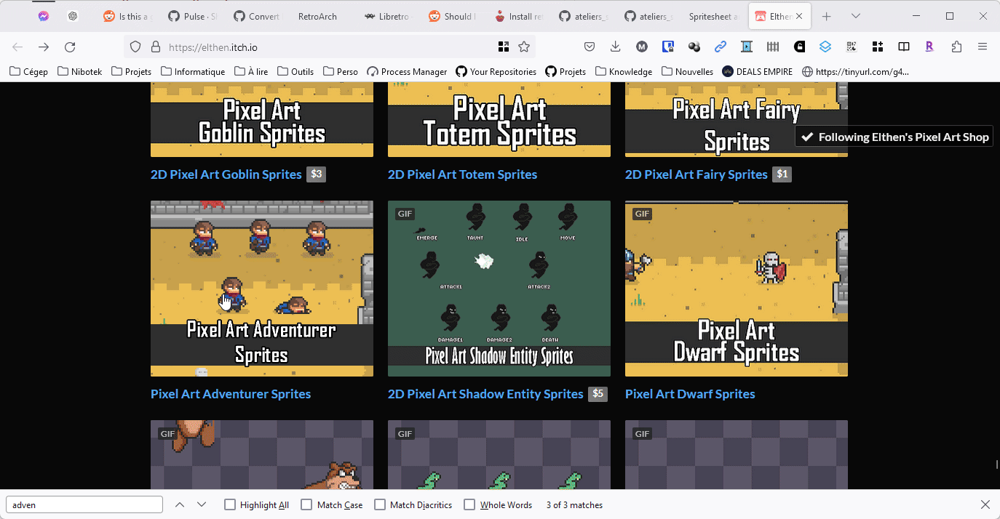

# Extras <!-- omit in toc -->

Cette article contient sous-articles supplémentaires pour t'aider à mieux utiliser Windows. Ces articles ne sont pas obligatoires, mais ils peuvent t'aider à mieux comprendre le fonctionnement de Windows.

# Table des matières <!-- omit in toc -->
- [Télécharger une image à partir d'un site web](#télécharger-une-image-à-partir-dun-site-web)
- [Télécharger une image à partir d'Itch.io](#télécharger-une-image-à-partir-ditchio)

# Télécharger une image à partir d'un site web
Lorsque tu veux créer un jeu vidéo, il est possible que tu aies besoin de télécharger des images à partir d'un site web. Voici comment tu peux télécharger une image à partir d'un site web :

1. Ouvre ton navigateur web.
2. Va sur le site web où tu veux télécharger l'image.
3. Clique droit sur l'image que tu veux télécharger.
4. Clique sur "Enregistrer l'image sous...".
5. Choisis l'emplacement où tu veux enregistrer l'image.
6. Clique sur "Enregistrer".
7. L'image devrait maintenant être enregistrée à l'emplacement que tu as choisi.
8. Tu peux maintenant utiliser cette image dans ton jeu vidéo.

# Télécharger une image à partir d'Itch.io
Dans les articles, plusieurs images sont téléchargées à partir d'Itch.io. 

Par exemple dans les articles, j'utilise des images de l'artiste Elthen. Son travail est disponible sur [Itch.io](https://elthen.itch.io/).

Voici comment tu peux télécharger une image à partir d'Itch.io :

1. Ouvre ton navigateur web.
2. Va sur la page de l'artiste sur Itch.io.
   - Par exemple, pour Elthen, tu peux aller sur [https://elthen.itch.io/](https://elthen.itch.io/).
3. Recherche les ressources que tu veux télécharger.
   - Par exemple pour les articles j'utilise "Pixel Art Adventurer Sprites" disponible sur [https://elthen.itch.io/pixel-art-adventurer-sprites](https://elthen.itch.io/pixel-art-adventurer-sprites).
4. Clique sur la page de l'image que tu veux télécharger.
5. Une fenêtre de type "pop-up" devrait s'ouvrir.
6. Clique sur le lien "No thanks, just take me to the downloads".
7. Ensuite, clique sur le bouton "Download".
8. Le fichier devrait maintenant être téléchargé sur ton ordinateur dans le dossier "Téléchargements".

